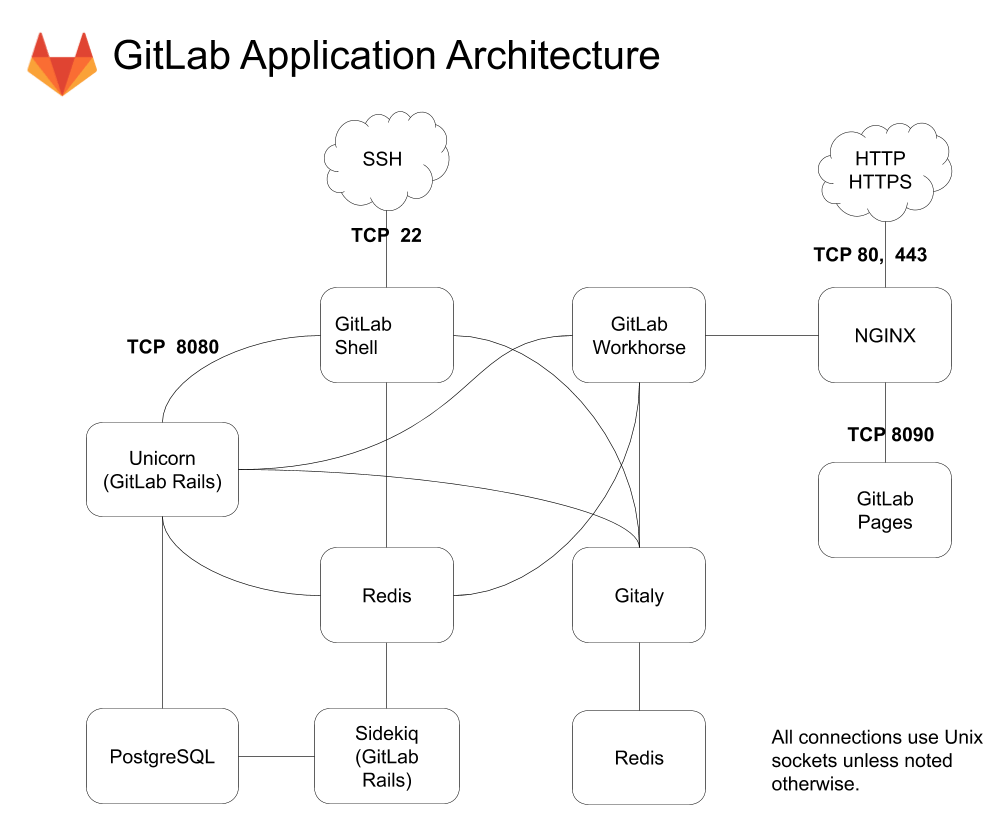

# GitLab 基础

[TOC]

## 架构

GitLab 是一个利用Ruby on Rails 开发的开源版本控制系统，实现一个自托管的Git项目仓库，可通过Web界面进行访问公开的或者私人项目。

GitLab由以下服务构成

- nginx: 静态web服务器
- gitlab-shell: 用于处理Git命令和修改authorized keys列表
- gitlab-workhorse: 轻量级的反向代理服务器
- logrotate：日志文件管理工具
- postgresql：数据库
- redis：缓存数据库
- sidekiq：用于在后台执行队列任务（异步执行）
- unicorn：An HTTP server for Rack applications，GitLab Rails应用是托管在这个服务器上面的。

## 基础组件



Gitlab通常安装在GNU/Linux上。使用Nignx或Apache 作为Web前端将请求代理到Unicorn Web 服务器

默认情况下，Unicorn 与前端之间的通信是通过 Unix domain 套接字进行的，但也支持通过 TCP 转发请求。Web 前端访问 /home/git/gitlab/public 绕过 Unicorn 服务器来提供静态页面，上传（例如头像图片或附件）和预编译资源。GitLab 使用 Unicorn Web 服务器提供网页和 GitLab API。使用 Sidekiq 作为作业队列，反过来，它使用 redis 作为作业信息，元数据和作业的非持久数据库后端。

GitLab 应用程序使用 MySQL 或 PostgreSQL 作为持久数据库，保存用户，权限，issue，其他元数据等，默认存储在 /home/git/repositories 中提供的 git repository。

通过 HTTP/HTTPS 提供 repository 时，GitLab 使用 GitLab API 来解析授权和访问以及提供 git 对象。

gitlab-shell 通过 SSH 提供 repository。它管理 /home/git/.ssh/authorized_keys 内的 SSH 密钥，不应手动编辑。gitlab-shell 通过 Gitaly 访问 bare repository 以提供 git 对象并与 redis 进行通信以向 Sidekiq 提交作业以供 GitLab 处理。gitlab-shell 查询 GitLab API 以确定授权和访问。

Gitaly 从 gitlab-shell 和 GitLab web 应用程序执行 git 操作，并为 GitLab web 应用程序提供 API 以从 git 获取属性（例如 title，branches，tags，其他元数据）和 blob（例如 diffs，commits ，files）

## 安装

[GitLab](https://docs.gitlab.com/ee/README.html) 是一个用于仓库管理系统的开源项目，使用Git作为代码管理工具，并在此基础上搭建起来的web服务。

参考

- https://about.gitlab.com/install/

### 编译安装

• 优点：可定制性强。数据库既可以选择MySQL,也可以选择PostgreSQL;服务器既可以选择Apache，也可以选择Nginx。
• 缺点：国外的源不稳定，被墙时，依赖软件包难以下载。配置流程繁琐、复杂，容易出现各种各样的问题。依赖关系多，不容易管理，卸载GitLab相对麻烦。

参考

- Installation from source
https://docs.gitlab.com/ee/install/installation.html 

- https://www.cnblogs.com/Alex-qiu/p/7845626.html

### 通过rpm/apt包安装

• 优点：安装过程简单，安装速度快。采用rpm包安装方式，安装的软件包便于管理。
• 缺点：数据库默认采用PostgreSQL，服务器默认采用Nginx，不容易定制。

通过GitLab官方提供的Omnibus安装包来安装，相对方便。Omnibus安装包套件整合了大部分的套件（Nginx、ruby on rails、git、redis、postgresql等），再不用额外安装这些软件，减轻了绝大部分安装量，相当于一键安装。

安装过程可以参考[GitLab Docker images](https://docs.gitlab.com/omnibus/docker/#run-the-image)

### 通过dokcer运行

#### 1. 创建gitlab相关目录

```bash
mkdir -p /data/gitlab/config
mkdir -p /data/gitlab/logs
mkdir -p /data/gitlab/data

# 赋予相关权限
chmod -R 777 /data
```

#### 2. 用docker启动gitlab

```bash
docker run --detach \
    --hostname gitlab.company.com \
    --publish 443:443 --publish 80:80 --publish 2289:22 \
    --name gitlab \
    --restart always \
    --volume /data/gitlab/config:/etc/gitlab \
    --volume /data/gitlab/logs:/var/log/gitlab \
    --volume /data/gitlab/data:/var/opt/gitlab \
    gitlab/gitlab-ce:VERSION
```

#### 3. 修改相关配置

> docker启动gitlab之后，会创建默认的配置文件`gitlab.rb`,修改配置文件`/data/gitlab/config/gitlab.rb`

**注意：** 配置文件路径和docker启动gitlab挂载的配置文件路径一致。

```bash
vim /data/gitlab/config/gitlab.rb
```

修改如下配置（没有则添加）：

```vim
gitlab_rails['gitlab_ssh_host'] = 'gitlab.company.com'
gitlab_rails['gitlab_shell_ssh_port'] = 2289
gitlab_rails[‘time_zone’] = ‘Asia/Shanghai’
```

> 重启gitlab

```bash
docker restart gitlab
```
