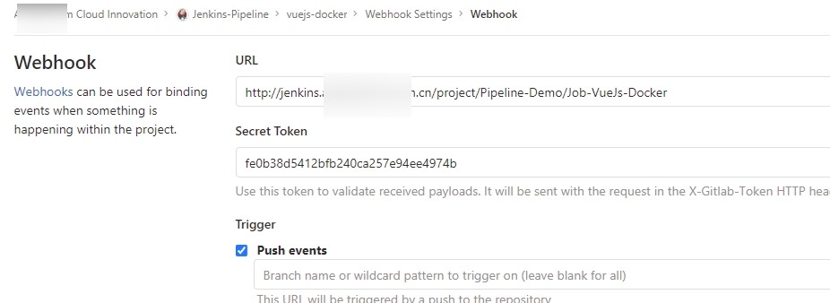

# jenkins-gitlab 集成

## gitlab webhook触发jenkins

### 1. 安装插件

jenkins系统管理下的插件管理，在线安装Gitlab Hook Plugin和Gitlab Plugin这两个插件

### 2. jenkins job配置

创建pipeline时， 勾选"Build when a change is pushed to GitLab". 记住后面的GitLab CI Service URL 后面要填在gitlab的webhooks中; 同时点击“高级”，生成 “Secret token“


### 3. gitlab webhook 配置

在链接那里输入之前jenkins上提供的webhook url 以及“Secret token“，编辑完后保存



点击测试，如果返回200，那就成功了，去jenkins看看有没有自动构建的记录


## jenkins build结果反馈给gitlab

```
pipeline {
  agent any

  options {
    gitLabConnection('Your GitLab Connection')
  }
 
  stages {
    stage('build') {
      steps {
        updateGitlabCommitStatus name: 'build', state: 'running'
        hogehoge
      }
    }
  }
 
  post {
    success {
      updateGitlabCommitStatus name: 'build', state: 'success'
    }
    failure {
      updateGitlabCommitStatus name: 'build', state: 'failed'
    }
  }
}
```

- gitLabConnection 是和GitLab接续的名称。GitLab名称的设定是在jenkins管理>系统设定>Gitlab当中设置详细的gitlab url和token
- updateGitlabCommitStatus
    - name: build 名称
    - state: pending, running, canceled, success, failed 
