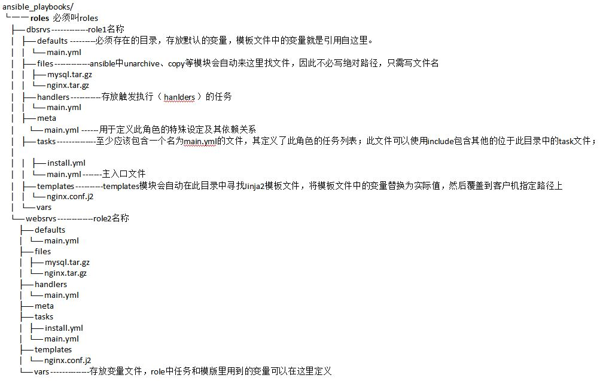

# Ansible Roles

[TOC]

## 1. 介绍

ansible自1.2版本开始引入的新特性，用于层次性，结构化地组织playbook。roles能够根据层次型结构自动装载变量文件、tasks以及handlers等

简单的说，roles是task文件、变量文件、handlers文件的集合体，这个集合体的显著特点是：可移植性和可重复执行性。

实践中，通常我们以部署某个服务为单元作为一个role ，然后将这些服务单元（role）放在一个roles目录下。主playbook文件通过调用roles目录下的role，来实现各种灵活多变的部署需求。

## 2. 创建roles

通常创建一个role的方法有两种：

- 命令mkdir和touch行手动创建
- 使用ansible-galaxy自动初始化一个role

命令行手动创建方式就无需多说了，即需要哪个目录和文件就用「mkdir」和「touch」命令创建出来。

例如，使用「ansible-galaxy init」命令创建一个名字为role_A 的role，可以这样写：`ansible-galaxy init role_A`


使用「ansible-galaxy」命令自动创建的role是最全的目录结构，根据需求，可以删除不用的目录文件。

## 3. roles的结构



role中各个目录下的main.yaml文件很重要，这是ansible默认加载的YAML文件

## 4. role的引用与执行

### 4.1. roles语句引用
比较常用的方法，我们可以使用「roles:」语句引用role ：

```yaml
- hosts: node1
  roles:
     - role_A
```

或者

``` yaml
- hosts: node1
  roles:
     - name: role_A
     - name: role_A
```

或者

```yaml
- hosts: node1
  roles:
     - role: role_A
     - role: role_A
```

或者使用绝对路径：

```yaml
# playbooks/test.yaml
- hosts: node1
  roles:
    - role: /root/lab-ansible/roles/role_A
```

引入的同时添加变量参数：

```yaml
# playbooks/test.yaml
- hosts: node1
  roles:
    - role: role_A
      vars:
        name: Maurice
        age: 100
```

引入的同时添加tag参数：

```yaml
#playbooks/test.yaml
- hosts: node1
  roles:
    - role: role_B
      tags:
        - tag_one
        - tag_two
```

等价于上面

```yaml
    - { role: role_B, tags:['tag_one','tag_two'] }
```

根据需求，我们在playbook中引用不同的role，引用后的效果也很好理解：ansible会把role所包含的任务、变量、handlers、依赖等加载到playbook中，顺次执行。

**检索路径**

上面介绍了使用「roles」语句的引用方法，那么ansible去哪找这些role呢？
在不使用绝对路径的情况下，ansible检索role的默认路径有：

- 执行ansible-playbook命令时所在的当前目录
- playbook文件所在的目录及playbook文件所在目录的roles目录
- 当前系统用户下的～/.ansible/roles目录
- /usr/share/ansible/roles目录
- ansible.cfg 中「roles_path」指定的目录，默认值为/etc/ansible/roles目录

注：上面的检索路径是在centos操作系统下测试出来的结果。

### 4.2 include和import引用

在后来版本（ansible>=2.4）中，ansible引入了「import_role」（静态）和「include_role」（动态）方法：

```yaml
#playbooks/test.yaml
- hosts: node1
  tasks:
    - include_role:
        name: role_A
      vars:
        name: maurice
        age: 100
    - import_role:
        name: role_B
```

比较于「roles」语句，「import_role」和「include_role」的优点如下：

- 可以在task之间穿插导入某些role，这点是「roles」没有的特性。
- 更加灵活，可以使用「when」语句等判断是否导入。

关于include_role（动态）和import_role（静态）的区别， 请自己查找。

### 4.3 重复引用

不添加其他变量、tag等的情况下，一个playbook中对同一个role引入多次时，实际ansible只会执行一次。

例如：

```yaml
# playbooks/test.yaml
- hosts: node1
  roles:
    - role_A
    - role_A
```

当然，我们也可以让其运行多次，方法如下：

- 引用role的同时定义不同的变量
- 在meta/main.yaml中添加「allow_duplicates: true」（这个特性有待验证……）

两种情况示例分别如下：

```yaml
- hosts: webservers
  roles:
  - role: foo
    vars:
         message: "first"
  - { role: foo, vars: { message: "second" } }
```

``` yaml
#playbook.yml
- hosts: webservers
  roles:
  - foo
  - foo

#roles/foo/meta/main.yml
allow_duplicates: true
```

### 4.4 执行顺序

在使用「pre_tasks」+「roles」+「tasks」+「post_tasks」结构下，task的执行顺序为：

- pre_task包含的play
- pre_task中handlers任务
- roles语句中role列表依次执行，每个role优先执行依赖的play及任务
- tasks语句中的所有play
- 前两步所触发的handlers
- post_tasks包含的play
- post_tasks触发的handlers

## 5. role的依赖

role的依赖指role_A可以引入其他的role，例如role_B。

roles的依赖知识点总结如下：

- 配置的路径在role_A的meta/main.yaml
- 引入role列表的方式只能使用类似「roles」语句的方法，只需将「roles」换为「dependencies」语句，不能用新版本的include和import语句

- 在meta/main.yaml文件内可以引入多个role，且必须以列表的形式引入
- 在引入role的同时，可以添加变量，方法同「roles」语句 

多层依赖
- 被引入的role总是优先执行，即便是同一个 role 被引入了多次。
