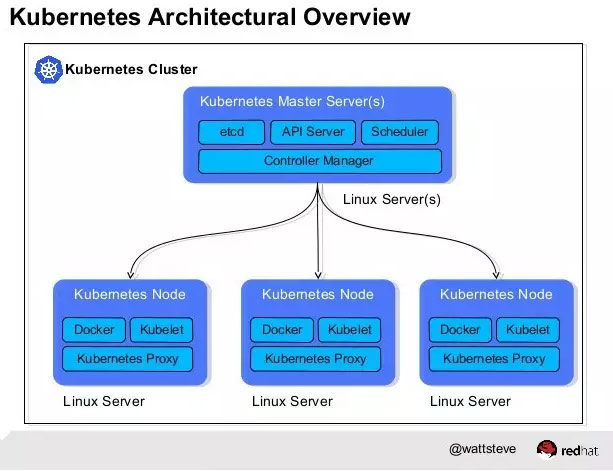
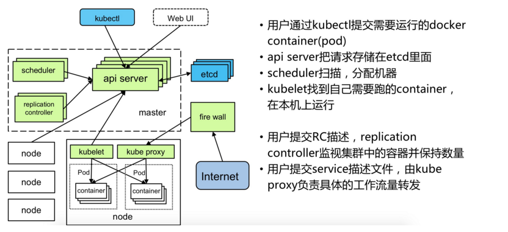
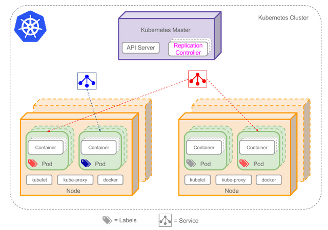

# Kubernetes 基础

[TOC]

Kubernetes 是容器编排管理系统，是一个开源的平台，可以实现容器集群的自动化部署、自动扩缩容、维护等功能。Kubernetes 是Google 2014年创建管理的，是Google 10多年大规模容器管理技术Borg的开源版本。Kubernetes 基本上已经是私有云部署的一个标准。

Kubernets有以下几个特点

- 可移植: 支持公有云，私有云，混合云，多重云（multi-cloud）
- 可扩展: 模块化, 插件化, 可挂载, 可组合
- 自动化: 自动部署，自动重启，自动复制，自动伸缩/扩展

K8s 是将8个字母 “ubernete” 替换为 “8” 的缩写，后续我们将使用 K8s 代替 Kubernetes

## 优势

1. 故障迁移：当某一个 node 节点关机或挂掉后，node 节点上的服务会自动转移到另一个 node 节点上，这个过程所有服务不中断。这是 docker 或普通云主机是不能做到的。

2. 资源调度：当 node 节点上的 cpu、内存不够用的时候，可以扩充 node 节点，新建的 pod 就会被 kube-schedule 调度到新扩充的 node 节点上。

3. 资源隔离：创建开发、运维、测试三个命名空间，切换上下文后，开发人员就只能看到开发命名空间的所有 pod，看不到运维命名空间的 pod，这样就不会造成影响，互不干扰。传统的主机或只有 docker 环境中，登录进去就会看到所有的服务或者容器。

4. 因为采用 docker 容器，进程之间互不影响，

5. 安全：不同角色有不同的权限，查看 pod、删除 pod 等操作；RBAC 认证增加了 k8s 的安全

## 参考

- [A Beginner’s Guide to Kubernetes](https://dzone.com/articles/a-beginners-guide-to-kubernetes)

## 架构

Kubernetes集群由很多节点组成，分为两大类：

- 主节点(master) 承载Kubernetes控制和管理整个集群系统的控制面板
- 工作节点(node) 运行实际部署的应用

其中，Master节点上运行着集群管理相关的一组进程 etcd、API Server、Controller Manager、Scheduler，后三个组件构成了Kubernetes的总控中心，这些进程实现了整个集群的资源管理、Pod调度、弹性伸缩、安全控制、系统监控和纠错等管理功能，并且全都是自动完成。

在每个Node上运行Kubelet、Proxy、Docker daemon三个组件，负责对本节点上的Pod的生命周期进行管理，以及实现服务代理的功能。

## 执行过程

通过Kubectl提交一个创建RC的请求，该请求通过API Server被写入etcd中，此时 Controller Manager通过 API Server的监听资源变化的接口监听到这个RC事件，分析之后，发现当前集群中还没有它所对应的Pod实例，于是根据RC里的Pod模板定义生成一个Pod对象，通过API Server写入etcd，接下来，此事件被Scheduler发现，它立即执行一个复杂的调度流程，为这个新Pod选定一个落户的Node，然后通过API Server 将这一结果写入到etcd中，随后，目标Node上运行的Kubelet进程通过API Server监测到这个“新生的”Pod，并按照它的定义，启动该Pod并任劳任怨地负责它的下半生，直到Pod的生命结束。

随后，我们通过Kubectl提交一个新的映射到该Pod的Service的创建请求，Controller Manager会通过Label标签查询到相关联的Pod实例，然后生成Service的Endpoints信息，并通过API Server写入到etcd中，接下来，所有Node上运行的Proxy进程通过 API Server 查询并监听Service对象与其对应的Endpoints信息，建立一个软件方式的负载均衡器来实现Service 访问到 后端Pod的流量转发功能。

- etcd
用于持久化存储集群中所有的资源对象，如Node、Service、Pod、RC、Namespace等；API Server提供了操作etcd的封装接口API，这些API基本上都是集群中资源对象的增删改查及监听资源变化的接口。

- Controller Manager
集群内部的管理控制中心，其主要目的是实现Kubernetes集群的故障检测和恢复的自动化工作，比如根据RC的定义完成Pod的复制或移除，以确保Pod实例数符合RC副本的定义；根据Service与Pod的管理关系，完成服务的Endpoints对象的创建和更新；其他诸如Node的发现、管理和状态监控、死亡容器所占磁盘空间及本地缓存的镜像文件的清理等工作也是由Controller Manager完成的。

- 客户端通过Kubectl命令行工具 或 Kubectl Proxy来访问Kubernetes系统，在Kubernetes集群内部的客户端可以直接使用Kuberctl命令管理集群。

- Kubectl Proxy是API Server的一个反向代理，在Kubernetes集群外部的客户端可以通过Kubernetes Proxy来访问API Server

## 架构2

- 核心层：Kubernetes 最核心的功能，对外提供 API 构建高层的应用，对内提供插件式应用执行环境
- 应用层：部署（无状态应用、有状态应用、批处理任务、集群应用等）和路由（服务发现、DNS 解析等）
- 管理层：系统度量（如基础设施、容器和网络的度量），自动化（如自动扩展、动态 Provision 等）以及策略管理（RBAC、Quota、PSP、NetworkPolicy 等）
- 接口层：kubectl 命令行工具、客户端 SDK 以及集群联邦
- 生态系统：在接口层之上的庞大容器集群管理调度的生态系统，可以划分为两个范畴
  - Kubernetes 外部：日志、监控、配置管理、CI、CD、Workflow等
  - Kubernetes 内部：CRI、CNI、CVI、镜像仓库、Cloud Provider、集群自身的配置和管理等

### 1. master

Master节点组件提供集群的管理控制中心，通常在一台VM/机器上启动所有Master组件，并且不会在此VM/机器上运行用户容器。

- `Etcd`: 是用来存储所有Kubernetes集群状态的，它除了具备状态存储的功能，还有事件监听和订阅、Leader选举的功能。事件监听和订阅指，其他组件各个通信并不是互相调用API来完成的，而是把状态写入Etcd（相当于写入一个消息），其他组件通过监听Etcd的状态的的变化（相当于订阅消息），然后做后续的处理，然后再一次把更新的数据写入Etcd。Leader选举指，其它一些组件比如 Scheduler，为了做实现高可用，通过Etcd从多个（通常是3个）实例里面选举出来一个做Master，其他都是Standby。

- `API Server`: Etcd是整个系统的最核心，所有组件之间通信都需要通过Etcd。实际上组件并不是直接访问Etcd，而是访问一个代理，这个代理是通过标准的RESTFul API，重新封装了对Etcd接口调用，除此之外，这个代理还实现了一些附加功能，比如身份的认证、缓存等，这个代理就是 API Server。

- `Controller manager`: 负责任务调度，简单说直接请求Kubernetes做调度的都是任务，例如Deployment 、DeamonSet、Pod等等，每一个任务请求发送给Kubernetes之后，都是由Controller Manager来处理的，每一种任务类型对应一个Controller Manager，比如 Deployment对应一个叫做Deployment Controller，DaemonSet对应一个DaemonSet Controller。

- `Scheduler`: 负责资源调度，Controller Manager 会把Pod对资源要求写入到Etcd里面，Scheduler监听到有新的Pod需要调度，就会根据整个集群的状态，把Pod分配到具体的worker节点上。

- `Kubectl`: 是一个命令行工具，它会调用API Server发送请求写入状态到Etcd，或者查询Etcd的状态。

### 2. worker

worker节点组件运行在每个k8s Node上，提供K8s运行时环境，以及维护Pod。

- `Kubelet`: 运行在每一个worker节点上的Agent，它会监听Etcd中的Pod信息，运行分配给它所在节点的Pod，并把状态更新回Etcd。通过docker部署

- `Kube-proxy`: 负责为Service提供cluster内部的服务发现和负载均衡。通过k8s部署

- `Docker`: Docker引擎，负责容器运行。

- `Container`: 负责镜像管理以及Pod和容器的真正运行（CRI）。

通过部署一个多实例Nginx服务来描述Kubernets内部的流程

1. 创建一个nginx_deployment.yaml配置文件。

2. 通过kubectl命令行创建一个包含Nginx的Deployment对象，kubectl会调用 `API Server` 往`Etcd`里面写入一个Deployment对象。

3. Deployment Controller监听到有新的Deployment对象被写入，获取到Deployment对象信息然后根据对象信息来做任务调度，创建对应的Replica Set对象。

4. Replica Set Controller监听到有新的对象被创建，获取到Replica Set对象信息然后根据对象信息来做任务调度，创建对应的Pod对象。

5. Scheduler监听到有新的Pod被创建，获取到Pod对象信息，根据集群状态将Pod调度到某一个worker节点上，然后更新Pod。

6. Kubelet监听到当前的节点被指定了的Pod，就根据对象信息运行Pod。

## 核心概念

1. Cluster: 集群指的是由K8s使用一序列的物理机、虚拟机和其它基础资源来运行你的应用程序。

2. Node: 一个Node就是一个运行着K8s的物理机或虚拟机，并且Pod可以在其上面被调度。

3. Pod: 一个Pod对应一个由相关容器和卷组成的容器组。

4. Label: 一个label是一个被附加到资源上的键值对，比如附加到一个Pod上为它传递一个用户自定的属性，label还可以被应用来组织和选择子网中的资源。

5. Selector: 是一个通过匹配labels来定义资源之间关系的表达式，例如为一个负载均衡的service指定目标Pod。

6. Replication Controller: replication controller 是为了保证Pod一定数量的复制品在任何时间都能正常工作，它不仅允许复制的系统易于扩展，还会处理当Pod在机器重启或发生故障的时候再创建一个。

7. Service: 一个service定义了访问Pod的方式，就像单个固定的IP地址和与其相对应的DNS名之间的关系。

8. Volume: 一个Volume是一个目录。

9. Kubernets Volume: 构建在Docker Volumes之上，并且支持添加和配置Volume目录或者其他存储设备。

10. Secret: Secret存储了敏感数据，例如能运行容器接受请求的权限令牌。

11. Name: 用户为Kubernets中资源定义的名字。

12. Namespace: namespace好比一个资源名字的前缀，帮助不同的项目可以共享cluster，防止出现命名冲突。

13. Annotation: 相对于label来说可以容纳更大的键值对，它对我们来说是不可读的数据，只是为了存储不可识别的辅助数据，尤其是一些被工具或系统扩展用来操作的数据。

### 1.Master

k8s集群的管理节点，负责管理集群，提供集群的资源数据访问入口。拥有Etcd存储服务（可选），运行Api Server进程，Controller Manager服务进程及Scheduler服务进程，关联工作节点Node。

- Kubernetes API server 提供HTTP Rest接口的关键服务进程，是Kubernetes里`所有资源的增、删、改、查等操作的唯一入口`。也是集群控制的入口进程；

- Kubernetes Controller Manager 是Kubernetes `所有资源对象的自动化控制中心`；
  
- Kubernetes Schedule 是`负责资源调度`（Pod调度）的进程

- etcd Server，Kubernetes里 所有的资源对象的数据全部是保存在etcd中

### 2、Node

Node作为集群中的工作节点，运行真正的应用程序，用来承载被分配Pod的运行，是Pod运行的宿主机，`在Node上Kubernetes 管理的最小运行单元是Pod`。

**每个Node节点都运行着以下一组关键进程:**

- kubelet：负责对Pod对于的容器的创建、启停等任务

- kube-proxy：实现K8S Service的通信与负载均衡机制的重要组件

- Docker Engine（Docker）：Docker引擎，负责本机容器的创建和管理工作

Node节点可以在运行期间动态增加到Kubernetes集群中，默认情况下，kubelet会向master注册自己，这也是Kubernetes推荐的Node管理方式，kubelet进程会定时向Master汇报自身情报，如操作系统、Docker版本、CPU和内存，以及有哪些Pod在运行等等，这样Master可以获知每个Node节点的资源使用情况，并实现高效均衡的资源调度策略。

### 3、Pod

`Pod是Kurbernetes进行创建、调度和管理的最小单位`，它提供了比容器更高层次的抽象，使得部署和管理更加灵活。一个Pod可以包含一个容器或者多个相关容器。

由于不能将多个进程聚集在一个单独容器，需要另外一种高级结构将容器绑定在一起，作为一个单元管理，这就是Pod背后根本原理， 一个pod中容器共享相同ip和端口空间

普通Pod一旦被创建，就会被放入etcd存储中，随后会被Kubernetes Master调度到摸个具体的Node上进行绑定，随后该Pod被对应的Node上的kubelet进程实例化成一组相关的Docker容器并启动起来，在。在默认情况下，当Pod里的某个容器停止时，Kubernetes会自动检测到这个问起并且重启这个Pod（重启Pod里的所有容器），如果Pod所在的Node宕机，则会将这个Node上的所有Pod重新调度到其他节点上。

同一个Pod里的容器共享同一个网络命名空间，可以使用localhost互相通信。

**一个Pod中的应用容器共享同一组资源：**

- PID命名空间：Pod中的不同应用程序可以看到其他应用程序的进程ID；

- 网络命名空间：Pod中的多个容器能够访问同一个IP和端口范围；

- IPC命名空间：Pod中的多个容器能够使用SystemV IPC或POSIX消息队列进行通信；

- UTS命名空间：Pod中的多个容器共享一个主机名；

- Volumes（共享存储卷）：Pod中的各个容器可以访问在Pod级别定义的Volumes；

Pod是短暂的，不是持续性实体。你可能会有这些问题：如果Pod是短暂的，那么我怎么才能持久化容器数据使其能够跨重启而存在呢？ 是的，Kubernetes支持卷的概念，因此可以使用持久化的卷类型。

Pod的生命周期通过Replication Controller来管理；通过模板进行定义，然后分配到一个Node上运行，在Pod所包含容器运行结束后，Pod结束。

如果Pod是短暂的，那么重启时IP地址可能会改变，那么怎么才能从前端容器正确可靠地指向后台容器呢？这时可以使用Service，下文会详细介绍。

Kubernetes为Pod设计了一套独特的网络配置，包括：为每个Pod分配一个IP地址，使用Pod名作为容器间通信的主机名等。

### 4、RC（Replication Controller）

Replication Controller用来管理Pod的副本，保证集群中存在指定数量的Pod副本。集群中副本的数量大于指定数量，则会停止指定数量之外的多余容器数量，反之，则会启动少于指定数量个数的容器，保证数量不变。Replication Controller是实现弹性伸缩、动态扩容和滚动升级的核心。

在Kubernetes集群中，它解决了传统IT系统中服务扩容和升级的两大难题。你只需为需要扩容的Service关联的Pod创建一个Replication Controller简称（RC），则该Service的扩容及后续的升级等问题将迎刃而解。在一个RC定义文件中包括以下3个关键信息。

- 目标Pod的定义；
- 目标Pod需要运行的副本数量；
- 要监控的目标Pod标签（Lable）；

Kubernetes通过RC中定义的Lable筛选出对应的Pod实例，并实时监控其状态和数量，如果实例数量少于定义的副本数量（Replicas），则会根据RC中定义的Pod模板来创建一个新的Pod，然后将此Pod调度到合适的Node上启动运行，直到Pod实例数量达到预定目标，这个过程完全是自动化的。

是否手动创建Pod，如果想要创建同一个容器的多份拷贝，需要一个个分别创建出来么，能否将Pods划到逻辑组里？

Replication Controller确保任意时间都有指定数量的Pod“副本”在运行。如果为某个Pod创建了Replication Controller并且指定3个副本，它会创建3个Pod，并且持续监控它们。如果某个Pod不响应，那么Replication Controller会替换它，保持总数为3.

如果之前不响应的Pod恢复了，现在就有4个Pod了，那么Replication Controller会将其中一个终止保持总数为3。如果在运行中将副本总数改为5，Replication Controller会立刻启动2个新Pod，保证总数为5。还可以按照这样的方式缩小Pod，这个特性在执行滚动升级时很有用。

当创建Replication Controller时，需要指定两个东西：

- Pod模板：用来创建Pod副本的模板
- Label：Replication Controller需要监控的Pod的标签。

现在已经创建了Pod的一些副本，那么在这些副本上如何均衡负载呢？我们需要的是Service。

### 5、Service

虽然每个Pod都会被分配一个单独的IP地址，但这个IP地址会随着Pod的销毁而消失，这就引出一个问题：`如果有一组Pod组成一个集群来提供服务，那么如何来访问它呢？Service！`

如果Pods是短暂的，那么重启时IP地址可能会改变，怎么才能从前端容器正确可靠地指向后台容器呢？

一个Service可以看作一组提供相同服务的Pod的对外访问接口，Service作用于哪些Pod是通过Label Selector来定义的。

- 拥有一个指定的名字（比如my-mysql-server）；

- 拥有一个虚拟IP（Cluster IP、Service IP或VIP）和端口号，销毁之前不会改变，只能内网访问；

- 能够提供某种远程服务能力；
  
- 被映射到了提供这种服务能力的一组容器应用上；

**外部系统访问Service的问题?**

首先需要弄明白Kubernetes的三种IP这个问题

- Node IP：Node节点的IP地址
- Pod IP： Pod的IP地址
- Cluster IP：Service的IP地址

首先,Node IP是Kubernetes集群中节点的物理网卡IP地址，所有属于这个网络的服务器之间都能通过这个网络直接通信。这也表明Kubernetes集群之外的节点访问Kubernetes集群之内的某个节点或者TCP/IP服务的时候，必须通过Node IP进行通信

其次，Pod IP是每个Pod的IP地址，他是Docker Engine根据docker0网桥的IP地址段进行分配的，通常是一个虚拟的二层网络。

最后Cluster IP是一个虚拟的IP，但更像是一个伪造的IP网络，原因有以下几点

- Cluster IP仅仅作用于Kubernetes Service这个对象，并由Kubernetes管理和分配P地址
  
- Cluster IP无法被ping，他没有一个“实体网络对象”来响应
  
- Cluster IP只能结合Service Port组成一个具体的通信端口，单独的Cluster IP不具备通信的基础，并且他们属于Kubernetes集群这样一个封闭的空间。

`如果Service要提供外网服务，需指定 公共IP和 NodePort，或外部负载均衡器；`

Service定义了Pod的逻辑集合和访问该集合的策略，是真实服务的抽象。Service提供了一个统一的服务访问入口以及服务代理和发现机制，关联多个相同Label的Pod，用户不需要了解后台Pod是如何运行。

现在，假定有2个后台Pod，并且定义后台Service的名称为‘backend-service’，lable选择器为（tier=backend, app=myapp）。backend-service 的Service会完成如下两件重要的事情：

- 会为Service创建一个本地集群的DNS入口，因此前端Pod只需要DNS查找主机名为 ‘backend-service’，就能够解析出前端应用程序可用的IP地址。

- 现在前端已经得到了后台服务的IP地址，但是它应该访问2个后台Pod的哪一个呢？Service在这2个后台Pod之间提供透明的负载均衡，会将请求分发给其中的任意一个，通过每个Node上运行的代理（kube-proxy）完成。这里有更多技术细节。

### 6、Volume

Volume是Pod中能够被多个容器访问的共享目录。

### 7、Label

容器提供了强大的隔离功能，所有有必要把为Service提供服务的这组进程放入容器中进行隔离。为此，Kubernetes设计了Pod对象，将每个服务进程包装到相对应的Pod中，使其成为Pod中运行的一个容器。为了建立Service与Pod间的关联管理，Kubernetes给每个Pod贴上一个标签Label，比如运行MySQL的Pod贴上name=mysql标签，给运行PHP的Pod贴上name=php标签，然后给相应的Service定义标签选择器Label Selector，这样就能巧妙的解决了Service于Pod的关联问题。

Kubernetes中的任意API对象都是通过Label进行标识，Label的实质是一系列的Key/Value键值对，其中key于value由用户自己指定。Label可以附加在各种资源对象上，如Node、Pod、Service、RC等，一个资源对象可以定义任意数量的Label，同一个Label也可以被添加到任意数量的资源对象上去。Label是Replication Controller和Service运行的基础，二者通过Label来进行关联Node上运行的Pod。

我们可以通过给指定的资源对象捆绑一个或者多个不同的Label来实现多维度的资源分组管理功能，以便于灵活、方便的进行资源分配、调度、配置等管理工作。
一些常用的Label如下：

- 版本标签："release":"stable","release":"canary"......
- 环境标签："environment":"dev","environment":"qa","environment":"production"
- 架构标签："tier":"frontend","tier":"backend","tier":"middleware"
- 分区标签："partition":"customerA","partition":"customerB"
- 质量管控标签："track":"daily","track":"weekly"

Label相当于我们熟悉的标签，给某个资源对象定义一个Label就相当于给它大了一个标签，随后可以通过Label Selector（标签选择器）查询和筛选拥有某些Label的资源对象，Kubernetes通过这种方式实现了类似SQL的简单又通用的对象查询机制。

**Label Selector在Kubernetes中重要使用场景如下:**

- kube-Controller进程通过资源对象RC上定义Label Selector来筛选要监控的Pod副本的数量，从而实现副本数量始终符合预期设定的全自动控制流程

- kube-proxy进程通过Service的Label Selector来选择对应的Pod，自动建立起每个Service岛对应Pod的请求转发路由表，从而实现Service的智能负载均衡

- 通过对某些Node定义特定的Label，并且在Pod定义文件中使用Nodeselector这种标签调度策略，kuber-scheduler进程可以实现Pod”定向调度“的特性

### 8、Replica Set

下一代的Replication Controlle，Replication Controlle 只支持基于等式的selector（env=dev或environment!=qa）但Replica Set还支持新的、基于集合的selector（version in (v1.0, v2.0)或env notin (dev, qa)），这对复杂的运维管理带来很大方便。

## Kubernetes 示例

搭建完k8s集群后，可以使用该示例体会 Kubernetes 的使用

- <k8s-demo>