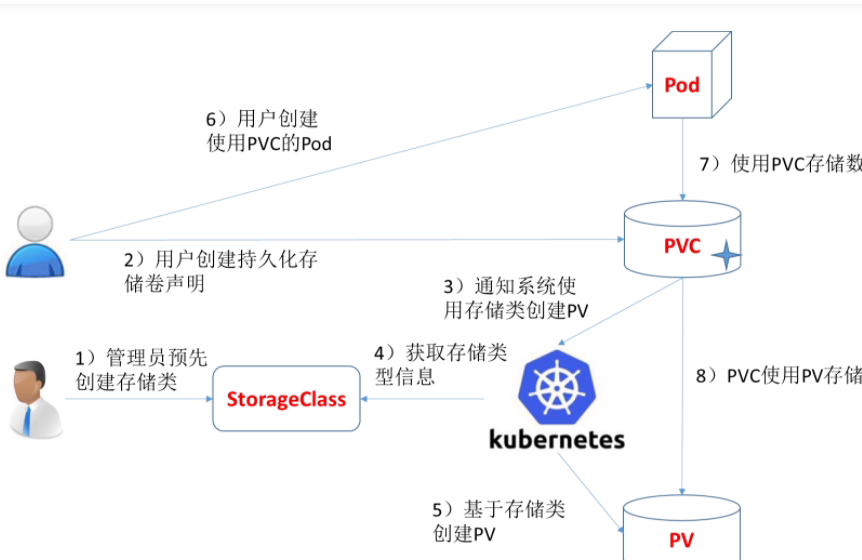
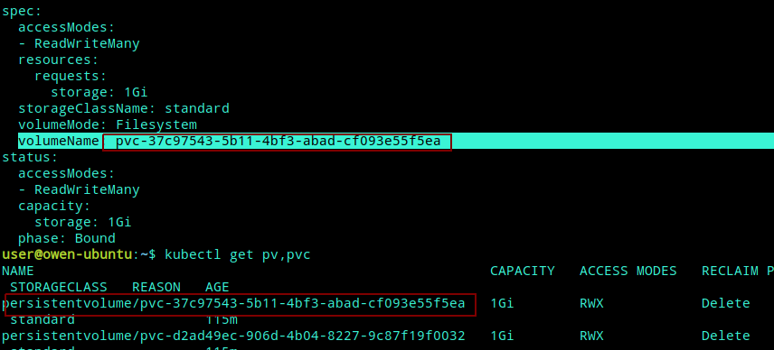
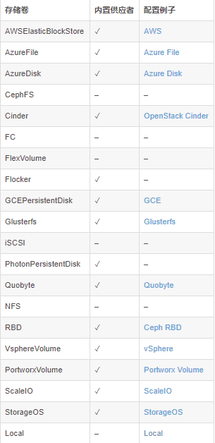
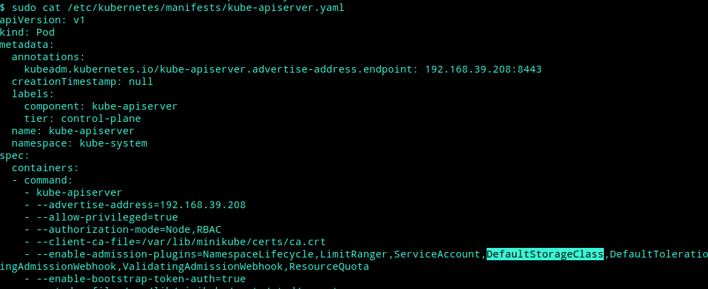

# StorageClass

[TOC]

## StorageClass解决的问题

- <https://kubernetes.io/docs/concepts/storage/storage-classes/>

PV是运维人员来创建的，开发操作PVC，可是大规模集群中可能会有很多PV，如果这些PV都需要运维手动来处理这也是一件很繁琐的事情，所以就有了动态供给概念，即`Dynamic Provisioning`。而我们上面的创建的PV都是静态供给方式，也就是`Static Provisioning`。

- <https://kubernetes.io/docs/concepts/storage/dynamic-provisioning/>

动态供给的关键就是StorageClass，它的作用就是创建PV模板。它需要定义PV属性比如存储类型、大小等；另外创建这种PV需要用到存储插件。最终效果是，用户提交PVC，里面指定存储类型，如果符合我们定义的StorageClass，则会为其自动创建PV并进行绑定。

**基于StorageClass的动态存储供应整体过程如下图所示：**



## 实现原理

- 存储控制器 Volume Controller，是用来专门处理持久化存储的控制器，其一个子控制循环 PersistentVolumeController 负责实现 PV 和 PVC 的绑定。

- PersistentVolumeController 会 watch kube-apiserver 的 PVC 对象。如果发现有 PVC对象创建，则会查看所有可用的 PV， 如果有则绑定，若没有，则会使用 StorageClass 的配置和 PVC 的描述创建 PV 进行绑定。

所谓将一个 PV 与 PVC 进行“绑定”，其实就是将这个PV对象的名字，填在了 PVC 对象的 spec.volumeName 字段上



## 定义存储类

每一个存储类都包含provisioner、parameters和reclaimPolicy这三个参数域，当一个属于某个类的PersistentVolume需要被动态提供时，将会使用上述的参数域。

存储类对象的名称非常重要，用户通过名称类请求特定的存储类。管理员创建存储类对象时，会设置类的名称和其它的参数，`存储类的对象一旦被创建，将不能被更新`。管理员能够为PVC指定一个默认的存储类。

``` yaml
kind: StorageClass
apiVersion: storage.k8s.io/v1
metadata:
  name: standard
provisioner: kubernetes.io/aws-ebs # 指定存储类的供应者
parameters:
  type: gp2
reclaimPolicy: Retain # 指定回收策略
mountOptions:
  - debug
```

### 供应者 -provisioner

- <https://kubernetes.io/docs/concepts/storage/storage-classes/#provisioner>

储类有一个供应者的参数域，此参数域决定PV使用什么存储卷插件。参数必需进行设置：



Kubernetes的存储类并不局限于表中的“interneal”供应者，“interneal”供应者的名称带有`“kubernetes.io”`前缀；也可以允许和指定外部的供应者，外部供应者通过独立的程序进行实现。 `kubernetes-sigs/sig-storage-lib-external-provisioner` 仓库中存在编写外部提供者的类库

## 使用存储类

动态存储卷供应基于StorageClass的API对象的来实现，集群管理员能够按需定义StorageClass对象，每一个StorageClass对象能够指定一个存储卷插件（即供应者）。集群管理员能够在一个集群中定义各种存储卷供应，用户不需要了解存储的细节和复杂性，就能够选择符合自己要求的存储。

### 启用动态供应

为了启用动态供应，集群管理员需要预先为用户创建一个或者多个存储类对象。存储类对象定义了使用哪个供应者，以及供应者相关的参数。下面是存储类的一个示例，它创建一个名称为slow的存储类，使用gce供应者：

``` yaml
apiVersion: storage.k8s.io/v1
kind: StorageClass
metadata:
  name: slow
provisioner: kubernetes.io/gce-pd
parameters:
  type: pd-standard
```

下面创建了一个名为“fast”的存储类，其提供类似固态磁盘的存储卷磁盘：

``` yaml
apiVersion: storage.k8s.io/v1
kind: StorageClass
metadata:
  name: fast
provisioner: kubernetes.io/gce-pd
parameters:
  type: pd-ssd
```

### 使用动态供应

下面是请求fast存储类的持久化存储卷声明的YAML配置文件示例：

``` yaml
apiVersion: v1
kind: PersistentVolumeClaim
metadata:
  name: claim1
spec:
  accessModes:
    - ReadWriteOnce
# 指定所使用的存储类，此存储类将会自动创建符合要求的PV
 storageClassName: fast
 resources:
    requests:
      storage: 30Gi
```

### 默认行为

如果Kubernetes的集群中没有指定存储类，集群管理员可以通过执行下面的设置，启用默认的存储类：

- 标记一个默认的StorageClass对象；
- 确定API server中DefaultStorage接入控制器已被启用

如下图：minikube环境中启用了 默认的StorageClass




管理员能够通过添加storageclass.kubernetes.io/is-default-class注释，标记一个特定的StorageClass作为默认的存储类。在集群中，如果存在一个默认的StorageClass，系统将能够在不指定storageClassName 的情况下创建一个PersistentVolume，DefaultStorageClass接入控制器会自动将storageClassName指向默认的存储类。

**注意：** 在一个集群中，最多只能有一个默认的存储类，如果没有默认的存储类，那么如果在PersistentVolumeClaim中没有显示指定storageClassName，则将无法创建PersistentVolume。

## NFS存储类示例

kubernetes本身支持的动态PV创建不包括nfs，所以需要使用额外插件实现

- <https://github.com/kubernetes-retired/external-storage/tree/master/nfs-client> `Moved to`  <https://github.com/kubernetes-sigs/nfs-subdir-external-provisioner>

    nfs-client is an automatic provisioner that use your existing and already configured NFS server to support dynamic provisioning of Kubernetes Persistent Volumes via Persistent Volume Claims. Persistent volumes are provisioned as ${namespace}-${pvcName}-${pvName}.

- <https://github.com/kubernetes-sigs/nfs-ganesha-server-and-external-provisioner>

下面我们以[nfs-provisioner](<https://github.com/kubernetes-sigs/nfs-ganesha-server-and-external-provisioner/tree/master/deploy/kubernetes>)为例

### 1. 部署nfs-provisioner

为nfs-provisioner实例选择存储状态和数据的存储卷，并将存储卷挂接到容器的/export 命令。

``` yaml
...
 volumeMounts:
    - name: export-volume
      mountPath: /export
volumes:
  - name: export-volume
    hostPath:
      path: /tmp/nfs-provisioner
...
```

为StorageClass选择一个供应者名称，并在deploy/kubernetes/deployment.yaml进行设置。

``` yaml
args:
  - "-provisioner=example.com/nfs"
```

在设置好deploy/kubernetes/deployment.yaml文件后，通过命令在Kubernetes集群中部署nfs-provisioner

`$ kubectl create -f {path}/deployment.yaml`

### 2. 创建StorageClass

下面是example-nfs的StorageClass配置文件，此配置文件定义了一个名称为nfs-storageclass的存储类，此存储类的提供者为nfs-provisioner。

``` yaml
kind: StorageClass
apiVersion: storage.k8s.io/v1
metadata:
  name: example-nfs
provisioner: example.com/nfs
mountOptions:
  - vers=4.1
```

通过命令使用上面的配置文件创建：`$ kubectl create -f deploy/kubernetes/class.yaml`

在存储类被正确创建后，就可以创建PVC来请求StorageClass，而StorageClass将会为PVC自动创建一个可用PV

### 3. 创建PVC

``` yaml
apiVersion: v1
kind: PersistentVolumeClaim
metadata:
  name: nfs-pvc
spec:
  accessModes:
  - ReadWriteMany
  storageClassName： nfs-storageclass
  resources:
    requests:
      storage: 1Mi
```

通过kubectl create命令创建上述的持久化存储卷声明：`$ kubectl create -f {path}/claim.yaml`

### 4. 创建使用PVC的部署

在这里定义名为busybox-deployment的部署YAML配置文件，使用的镜像为busybox。基于busybox镜像的容器需要对/mnt目录下的数据进行持久化，在YAML文件指定使用名称为nfs的PersistenVolumeClaim对容器的数据进行持久化。

``` yaml
# This mounts the nfs volume claim into /mnt and continuously
# overwrites /mnt/index.html with the time and hostname of the pod. 
apiVersion: v1
kind: Deployment
metadata:  
  name: busybox-deployment
spec:  
  replicas: 2  
  selector:
    name: busybox-deployment
  template:
    metadata:
      labels:
        name: busybox-deployment
    spec:
      containers:
      - image: busybox
        command:
        - sh
        - -c
        - 'while true; do date > /mnt/index.html; hostname >> /mnt/index.html; sleep $(($RANDOM % 5 + 5)); done'
        imagePullPolicy: IfNotPresent
        name: busybox
        volumeMounts:
        # name must match the volume name below
        - name: nfs
          mountPath: "/mnt"
     volumes:
     - name: nfs
       persistentVolumeClaim:
         claimName: nfs-pvc
```

通过kubectl create创建busy-deployment部署：`$ kubectl create -f {path}/nfs-busybox-deployment.yaml`

