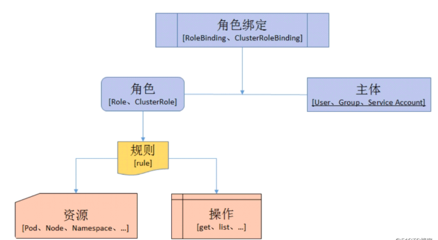
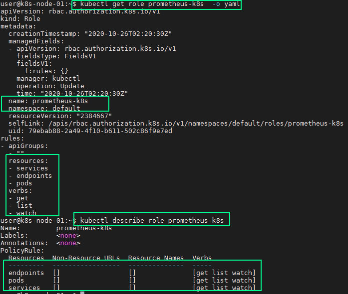
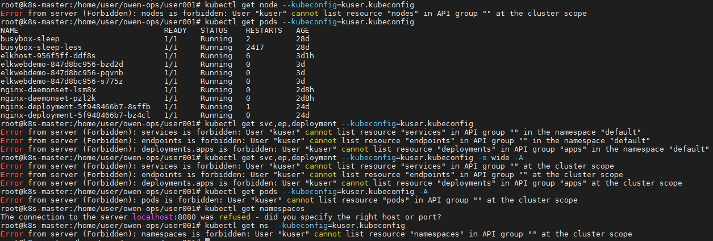

# 基于角色的访问控制 -RBAC

[TOC]

RBAC基于角色的访问控制--Role-Based Access Control

- <https://kubernetes.io/docs/reference/access-authn-authz/rbac/>

## 概念

- RBAC
    RBAC是kubernetes的一种认证访问授权机制，【不授权就没有资格访问K8S的资源】

    要使用RBAC授权模式，需要在API Server的启动参数中加上--authorization-mode=RBAC

    RBAC引入了4个新的顶级资源对象：Role、ClusterRole、RoleBinding、ClusterRoleBinding，同其他API资源对象一样，用户可以使用kubectl或者API调用等方式操作这些资源对象

- 主体（subjects）
  K8S有两种用户：`User`和`Service Account`。其中，User给人用，Service Account给进程用，让进程有相关权限。如Dashboard就是一个进程，我们就可以创建一个Service Account给它

- 角色(role)
  
  Role是一系列权限的集合，例如一个Role可包含读取和列出 Pod的权限【 ClusterRole(集群角色) 和 Role 类似，其权限范围是整个集群】

- 角色绑定(rolebinding)
  
  RoleBinding把角色映射到用户，从而让这些用户拥有该角色的权限【ClusterRoleBinding(绑定到集群) 和RoleBinding 类似，可让用户拥有 ClusterRole 的权限】

  如果使用rolebinding绑定到clusterrole上，表示绑定的用户只能用于当前namespace的权限

- Secret
  
  Secret是一个包含少量敏感信息如密码，令牌，或秘钥的对象。把这些信息保存在 Secret对象中，可以在这些信息被使用时加以控制，并可以降低信息泄露的风险

## RBAC 授权

**RBAC的授权步骤分为两步:**

1. 定义角色：在定义角色时会指定此角色对于资源的访问控制的规则；

2. 绑定角色：将主体与角色进行绑定，对用户进行访问授权。

    

### Role与ClusterRole

一个角色包含了一套表示一组权限的规则。 权限以纯粹的累加形式累积（没有"否定"的规则）

- Role:角色可以由`命名空间`内的Role对象定义,一个Role对象只能用于授予对某一单一命名空间中资源的访问权限
- ClusterRole:整个Kubernetes`集群范围内`有效的角色则通过ClusterRole对象实现

#### Role

``` yaml
kind: Role
apiVersion: rbac.authorization.k8s.io/v1
metadata:
  namespace: default
  name: pod-reader
rules:
- apiGroups: [""] # "" indicates the core API group
  resources: ["pods"]
  verbs: ["get", "watch", "list"]
```

**rules中的参数说明：**

- apiGroup：支持的API组列表，例如：APIVersion: batch/v1、APIVersion: extensions:v1、apiVersion:apps/v1等
- resources：支持的资源对象列表，例如：pods、deployments、jobs等
- verbs：对资源对象的操作方法列表，例如：get、watch、list、delete、replace、patch等



#### ClusterRole

集群角色除了具有和角色一致的命名空间内资源的管理能力，因其集群级别的范围，还可以用于以下特殊元素的授权。

- 集群范围的资源，例如Node
- 非资源型的路径，例如/healthz
- 包含全部命名空间的资源，例如pods

``` yaml
kind:ClusterRole
apiVersion:rbac.authorization.k8s.io/v1
metadata:
  name:secret-reader
  # ClusterRole不受限于命名空间，所以省略了namespace name的定义
rules:
- apiGroups:[""]
  resources:["secrets"] #明确资源类型
  verbs:["get","watch","list"]
```

#### 对资源的引用方式

多数资源可以用其名称的字符串来表达，也就是Endpoint中的URL相对路径，例如pods。然后，某些Kubernetes API包含下级资源，例如Pod的日志(logs)。Pod日志的Endpoint是`GET /api/v1/namespaces/{namespaces}/pods/{name}/log`

Pod是一个命名空间内的资源，log就是一个下级资源。要在一个RBAC角色中体现，则需要用斜线/来分割资源和下级资源。若想授权让某个主体同时能够读取Pod和Pod log，则可以配置resources为一个数组：

``` yaml
kind: Role
apiVersion: rbac.authorization.k8s.io/v1
metadata:
  namespace: default
  name: pod-and-pod-logs-reader
rules:
- apiGroups: [""]
  resources: ["pods", "pods/log"]
  verbs: ["get", "list"]
```

资源还可以通过名字(ResourceName)进行引用。在指定ResourceName后，使用get、delete、update、patch动词的请求，就会被限制在这个资源实例范围内。例如下面的声明让一个主体只能对一个叫my-configmap的configmap进行get和update操作：

``` yaml
kind: Role
apiVersion: rbac.authorization.k8s.io/v1
metadata:
  namespace: default
  name: configmap-updater
rules:
- apiGroups: [""]
  resources: ["configmap"]
  resourceNames: ["my-configmap"]
  verbs: ["update", "get"]
```

### Subjects

- 用户名Alice@example.com

``` yaml
subjects:
- kind: User
  name: "Alice@example.com"
  apiGroup: rbac.authorization.k8s.io
```

- 组名frontend-admins

``` yaml
subjects:
- kind: Group
  name: "frontend-admins"
  apiGroup: rbac.authorization.k8s.io
```

- 所有Service Account

``` yaml
subjects:
- kind: Group
  name: system:serviceaccounts
  apiGroup: rbac.authorization.k8s.io
```

- 所有认证用户

``` yaml
subjects:
- kind: Group
  name: system:authentication
  apiGroup: rbac.authorization.k8s.io
```

- 全部用户

``` yaml
subjects:
- kind: Group
  name: system:authentication
  apiGroup: rbac.authorization.k8s.io
- kind: Group
  name: system:unauthentication
  apiGroup: rbac.authorization.k8s.io
```

### RoleBinding和ClusterRoleBinding

角色绑定或集群角色绑定用来把一个角色绑定到一个目标上，绑定目标可以是`User、Group或者Service Account`。使用RoleBinding为某个命名空间授权，ClusterRoleBinding为集群范围内授权

**示例如下:**

下例中的RoleBinding将在default命名空间中把pod-reader角色授予用户jane，可以让jane用户读取default命名空间的Pod：

```yaml
kind:RoleBinding
apiVersion:rbac.authorization.k8s.io/v1
metadata:
  name:read-pods
  namespace:default
subjects: #主体
- kind:ServiceAccount
  name:jane
  apiGroup:rbac.authorization.k8s.io
roleRef: #引用的角色
  kind:Role
  name:pod-reader
  apiGroup:rbac.authorization.k8s.io
```

RoleBinding也可以引用ClusterRole，对属于同一命名空间内ClusterRole定义的资源主体进行授权。一种常见的做法是集群管理员为集群范围预先定义好一组角色(ClusterRole)，然后在多个命名空间中重复使用这些ClusterRole。

如下，使用RoleBinding绑定集群角色secret-reader，使dave只能读取development命名空间中的secret：

``` yaml
kind: RoleBinding
apiVersion: rbac.authorization.k8s.io/v1
metadata:
  name: read-secrets
  namespace: development

subjects:
- kind: User
  name: dave
  apiGroup: rbac.authorization.k8s.io
roleRef:
  kind: ClusterRole
  name: secret-reader
  apiGroup: rbac.authorization.k8s.io
```

集群角色绑定中的角色只能是集群角色，用于进行集群级别或者对所有命名空间都生效的授权。

如下，允许manager组的用户读取任意namespace中的secret

``` yaml
kind:ClusterRoleBinding
apiVersion:rbac.authorization.k8s.io/v1
metadata:
  name:read-secrets-global
subjects:
- kind:ServiceAccount
  name:manager
  apiGroup:rbac.authorization.k8s.io
roleRef:
  kind:ClusterRole
  name:secret-reader
  apiGroup:rbac.authorization.k8s.io
```

这样就完成了一个完整的授权

#### 默认的角色和角色绑定

API Server会创建一套默认的ClusterRole和ClusterRoleBinding对象，其中很多是以system:为前缀的，以表明这些资源属于基础架构，对这些对象的改动可能造成集群故障。

有些默认角色不是以system:为前缀的，这部分角色是针对用户的

所有默认的ClusterRole和RoleBinding都会用标签`kubernetes.io/bootstrapping=rbac-defaults`进行标记


#### 授权注意事项：预防提权和授权初始化

RBAC API拒绝用户利用编辑角色或者角色绑定的方式进行提权。这一限制是在API层面做出的，因此即使RBAC没有启用也仍然有效。

用户只能在拥有一个角色的所有权限，且与该角色的生效范围一致的前提下，才能对角色进行创建和更新。例如用户user-1没有列出集群中所有secret的权限，就不能创建具有这一权限的集群角色。要让一个用户能够创建或更新角色，需要以下权限：

- 为其授予一个允许创建/更新Role或ClusterRole资源对象的角色；

为用户授予角色，要覆盖该用户所能控制的所有权限范围。用户如果尝试创建超出其自身权限的角色或者集群角色，则该API调用会被禁止。

如果一个用户的权限包含了一个角色的所有权限，那么就可以为其创建和更新角色绑定；或者如果被授予了针对某个角色的绑定授权，则也有权完成此操作。

例如：user1没有列出集群内所有secret的权限，就无法为一个具有这样权限的角色创建集群角色绑定。要使用户能够创建、更新这一角色绑定，则需要有如下做法：

- 为其授予一个允许创建和更新角色绑定或者集群角色绑定的角色

- 为其授予绑定某一角色的权限，有隐式或显式两种方法
  - 隐式：让其具有所有该角色的权限
  - 显式：让用户授予针对该角色或集群角色绑定操作的权限

如下，让user-1有对user-1-namespace命名空间中的其他用户授予admin、edit及view角色

``` yaml
apiVersion: rbac.authorization.k8s.io/v1
kind: ClusterRole
metadata:
  name: role-grantor
rules:
- apiGroups: ["rbac.authorization.k8s.io"]
  resources: ["rolebindings"]
  verbs: ["create"]
- apiGroups: ["rbac.authorization.k8s.io"]
  resources: ["clusterroles"]
  verbs: ["bind"]
  resourceNames: ["admin", "edit", "view"]
---
apiVersion: rbac.authorization.k8s.io/v1
kind: RoleBinding
metadata:
  name: role-grantor-binding
  namespace: user-1-namespace
roleRef:
  apiGroup: rbac.authorization.k8s.io
  kind: ClusterRole
  name: role-grantor
subjects:
- apiGroup: rbac.authorization.k8s.io
  kind: User
  name: user-1
```

## 证书认证+RBAC授权 示例

示例：为kuser用户授权default命名空间Pod读取权限

1. 用K8S CA签发客户端证书 - <https://www.kubernetes.org.cn/1861.html>
2. 生成kubeconfig授权文件
3. 创建RBAC权限策略

### 1. 通过CA证书生成自签证书

``` shell
mkdir  ./kuser
sh  cert.sh  

## 创建 CA 配置文件
cat > ca-config.json <<EOF
{
  "signing": {
    "default": {
      "expiry": "8760h"
    },
    "profiles": {
      "kubernetes": {
        "usages": [
            "signing",
            "key encipherment",
            "server auth",
            "client auth"
        ],
        "expiry": "8760h"
      }
    }
  }
}
EOF

## 创建 CA 证书签名请求
cat > ca-csr.json <<EOF
{
  "CN": "kuser",
  "key": {
    "algo": "rsa",
    "size": 2048
  },
  "names": [
    {
      "C": "CN",
      "ST": "BeiJing",
      "L": "BeiJing",
      "O": "k8s",
      "OU": "System"
    }
  ]
}
EOF

cat > kuser-csr.json <<EOF
{
  "CN": "kuser",
  "key": {
    "algo": "rsa",
    "size": 2048
  },
  "names": [
    {
      "C": "CN",
      "ST": "BeiJing",
      "L": "BeiJing",
      "O": "k8s",
      "OU": "System"
    }
  ]
}
EOF
```

生成 CA 证书和私钥 `cfssl gencert -initca ca-csr.json | cfssljson -bare ca`

上面方案生成ca.pem 和ca-key.pem 可能出现下列问题

``` shell
user@k8s-master:~/owen-ops/user001$ sudo kubectl get nodes  --kubeconfig=kuser.kubeconfig
Unable to connect to the server: x509: certificate signed by unknown authority
```

暂时未解决，使用下面方案直接使用k8s初始化生成的 ca.pem 和ca-key.pem

- .key 转换成 .pem：
    `openssl rsa -in temp.key -out temp.pem`

    `root@k8s-master:/home/user/# openssl x509 -in /etc/kubernetes/pki/ca.crt -out ca.pem -outform PEM`

- .crt 转换成 .pem：

    `openssl x509 -in tmp.crt -out tmp.pem`

    `root@k8s-master:/home/user/# openssl rsa -in /etc/kubernetes/pki/ca.key -out ca-key.pem -outform PEM`

#### 使用CFSSL自签TLS证书

- CFSSL: Cloudflare's PKI and TLS toolkit  通过命令`apt install golang-cfssl`安装

`cfssl gencert -ca=ca.pem -ca-key=ca-key.pem -config=ca-config.json -profile=kubernetes kuser-csr.json | cfssljson -bare kuser`

通过指定的ca配置生成 kuser-key.pem  kuser.pem

### 2. 生成kubeconfig授权文件

``` shell
cd ./kuser
sh config.sh

kubectl config set-cluster kubernetes \
  --certificate-authority=ca.pem \
  --embed-certs=true \
  --server=https://172.20.249.16:6443 \
  --kubeconfig=kuser.kubeconfig

# 设置客户端认证
kubectl config set-credentials kuser \
  --client-key=kuser-key.pem \
  --client-certificate=kuser.pem \
  --embed-certs=true \
  --kubeconfig=kuser.kubeconfig

# 设置默认上下文
kubectl config set-context kubernetes \
  --cluster=kubernetes \
  --user=kuser \
  --kubeconfig=kuser.kubeconfig

# 设置当前使用配置
kubectl config use-context kubernetes --kubeconfig=kuser.kubeconfig
```

执行 config.sh 生成 kuser.kubeconfig

### 3. 创建RABC授权

``` yaml
kind: Role
apiVersion: rbac.authorization.k8s.io/v1
metadata:
  namespace: default
  name: pod-reader
rules:
- apiGroups: [""]
  resources: ["pods"]
  verbs: ["get", "watch", "list"]

---

kind: RoleBinding
apiVersion: rbac.authorization.k8s.io/v1
metadata:
  name: read-pods
  namespace: default
subjects:
- kind: User
  name: kuser
  apiGroup: rbac.authorization.k8s.io
roleRef:
  kind: Role
  name: pod-reader
  apiGroup: rbac.authorization.k8s.io
```

### 4. 验证

如果不指定 kubeconfig 文件的时候发现 查看不了;指定授权后的kubeconfig文件 可以查看你default名称空间下的 pod资源

但是却不能访问非 default 名称空间下的pod，和所有名称空间下的其他资源，因为授权查看的资源只有default名称空间下的pod资源



### 5. 增加权限验证

根据上面的 `rabc.yaml` 增加resources 列表 查看pod日志和查看service的权限

``` yaml
rules:
- apiGroups: [""]
  resources: ["pods","services"]
  verbs: ["get", "watch", "list"]
```


如何让自定义授权文件成为默认文件？

`cp xxxx.kubeconfig /root/.kube/config`

如果没有 .kube 目录就创建一个，这样就会读取默认配置文件  /root/.kube/config