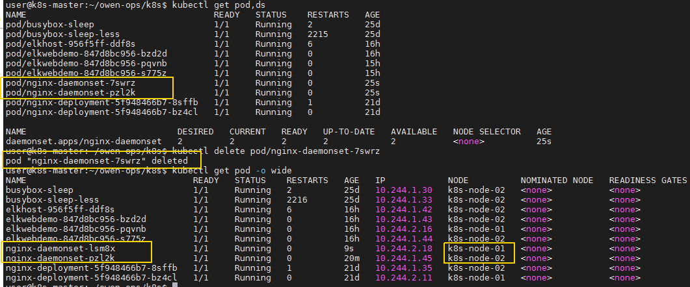

# DaemonSet

[TOC]

## 特点

- 在每一个Node上运行一个Pod

- 新加入的Node也同样会自动运行一个Pod

使用 DaemonSet 的一些典型用法：

- 运行集群存储 daemon，例如在每个 Node 上运行 glusterd 、 ceph
- 在每个 Node 上运行日志收集 daemon，例如 fluentd 、 logstash
- 在每个 Node 上运行监控 daemon，例如 Prometheus Node Exporter、 collectd 、Datadog 代理、New Relic 代理，或 Ganglia gmond

## 创建 DaemonSet

用 DaemonSet 控制器类型创建nginx pod资源，没有指定副本replicats，它会根据node节点的个数创建，如果再新加一个node节点，也会给新node节点创建pod

``` yaml
apiVersion: apps/v1
kind: DaemonSet
metadata:
  name: nginx-daemonset
  labels:
    app: nginx-ds
spec:
  selector:
    matchLabels:
      app: nginx-ds-pod
  template:
    metadata:
      labels:
        app: nginx-ds-pod
    spec:
      containers:
      - name: nginx
        image: nginx:1.15.4
        ports:
        - containerPort: 80
```

如图所示，删除以后，会重新创建一个。



## 指定Node节点运行DaemonSet

DaemonSet会忽略Node的unschedulable状态，以下方式来指定Pod只运行在指定的Node节点上：

- nodeSelector： 只调度到匹配指定label的Node上
- nodeAffinity： 功能更丰富的Node选择器，比如支持集合操作
- podAffinity：  调度到满足条件的Pod所在的Node上

### nodeSelector 示例

首先给Node打上标签

`kubectl label nodes node-01 disktype=ssd`

然后在daemonset中指定nodeSelector为disktype=ssd：

``` yaml
spec:
  nodeSelector:
    disktype: ssd
```

### nodeAffinity 示例

nodeAffinity 目前支持两种：`requiredDuringSchedulingIgnoredDuringExecution`和`preferredDuringSchedulingIgnoredDuringExecution`，分别代表必须满足条件和优选条件。

比如下面的例子代表调度到包含标签kubernetes.io/e2e-az-name并且值为e2e-az1或e2e-az2的Node上，并且优选还带有标签another-node-label-key=another-node-label-value的Node。

``` yaml
apiVersion: v1
kind: Pod
metadata:
  name: with-node-affinity
spec:
  affinity:
    nodeAffinity:
      requiredDuringSchedulingIgnoredDuringExecution:
        nodeSelectorTerms:
        - matchExpressions:
          - key: kubernetes.io/e2e-az-name
            operator: In
            values:
            - e2e-az1
            - e2e-az2
      preferredDuringSchedulingIgnoredDuringExecution:
      - weight: 1
        preference:
          matchExpressions:
          - key: another-node-label-key
            operator: In
            values:
            - another-node-label-value
  containers:
  - name: with-node-affinity
    image: gcr.io/google_containers/pause:2.0

```

### podAffinity 示例

podAffinity基于Pod的标签来选择Node，仅调度到满足条件Pod所在的Node上，支持`podAffinity`和`podAntiAffinity`。这个功能比较绕，以下面的例子为例：

- 如果一个“Node所在Zone中包含至少一个带有security=S1标签且运行中的Pod”，那么可以调度到该Node
- 不调度到“包含至少一个带有security=S2标签且运行中Pod”的Node上

``` yaml
apiVersion: v1
kind: Pod
metadata:
  name: with-pod-affinity
spec:
  affinity:
    podAffinity:
      requiredDuringSchedulingIgnoredDuringExecution:
      - labelSelector:
          matchExpressions:
          - key: security
            operator: In
            values:
            - S1
        topologyKey: failure-domain.beta.kubernetes.io/zone
    podAntiAffinity:
      preferredDuringSchedulingIgnoredDuringExecution:
      - weight: 100
        podAffinityTerm:
          labelSelector:
            matchExpressions:
            - key: security
              operator: In
              values:
              - S2
          topologyKey: kubernetes.io/hostname
  containers:
  - name: with-pod-affinity
    image: gcr.io/google_containers/pause:2.0

```