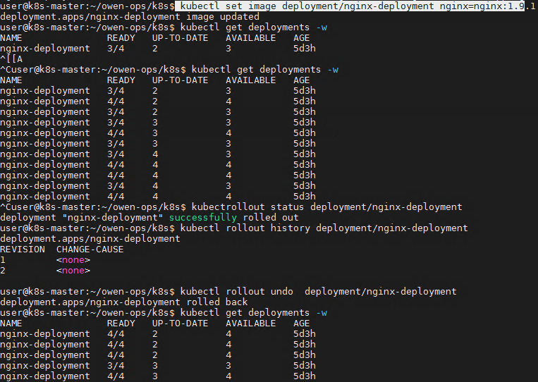
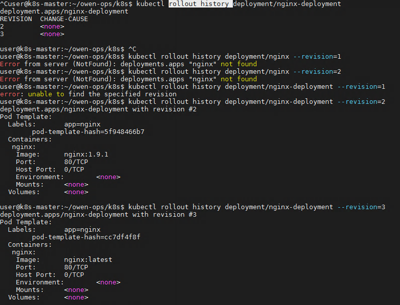
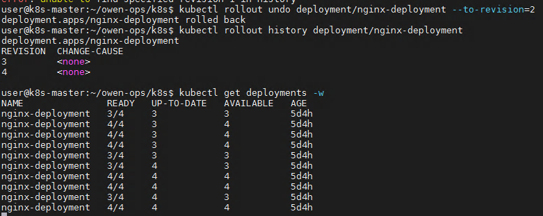

# Deployment

[TOC]

Deployment是⼀个⽐RS应⽤模式更⼴的API对象，可以是创建⼀个新的服务，更新⼀个新的服务，也可以是滚动升级⼀个服务。

滚动升级⼀个服务-->实际是创建⼀个新的RS，然后逐渐将新RS中副本数增加到理想状态，将旧RS中的副本数减少到0的复合操作；这样⼀个复合操作⽤⼀个RS是不太好描述的，所以⽤⼀个更通⽤的Deployment来描述。

## 特点

- 部署`无状态`应用，只关心数量，不论角色等，称无状态
- 管理Pod和ReplicaSet
- 具有上线部署、副本设定、滚动升级、回滚等功能
- 提供声明式更新，例如只更新一个新的image

- **应用场景: web 服务**

## Deployment 操作

### 1. 创建Deployment

```yaml
apiVersion: apps/v1
kind: Deployment
metadata:
  name: frontend
spec:
  replicas: 1
  selector:
    matchLabels:
      tier: frontend
    matchExpressions:
      - {key: tier, operator: In, values: [frontend]}
  template:
    metadata:
      labels:
        app: app-demo
        tier: frontend
    spec:
      containers:
      - name: tomcat-demo
        image: tomcat
# 设置资源限额，CPU通常以千分之一的CPU配额为最小单位，用m来表示。通常一个容器的CPU配额被定义为100~300m，即占用0.1~0.3个CPU；
        resources:
          requests:
            memory: "64Mi"
            cpu: "250m"
          limits:
            memory: "128Mi"
            cpu: "500m"
        imagePullPolicy: IfNotPresent
        ports:
        - containerPort: 8080
```

创建Deployment - `kubectl create -f tomcat-deployment.yaml`

``` text
user@owen-ubuntu:~$ kubectl get deployments
NAME       READY   UP-TO-DATE   AVAILABLE   AGE
frontend   1/1     1            1           2m32s

# 注意 这里的名称与Deployment里面名称的关系
user@owen-ubuntu:~$ kubectl get rs
NAME                  DESIRED   CURRENT   READY   AGE
frontend-5955854c9c   1         1         1       2m33s

#Pod的命名以Deployment对应的Replica Set的名字为前缀
user@owen-ubuntu:~$ kubectl get pods
NAME                        READY   STATUS    RESTARTS   AGE
frontend-5955854c9c-dw9hj   1/1     Running   0          3m4s

- DESIRED，Pod副本数量的期望值，及Deployment里定义的Replica；
- CURRENT，当前Replica实际值；
- UP-TO-DATE，最新版本的Pod的副本数量，用于指示在滚动升级的过程中，有多少个Pod副本已经成功升级；
- AVAILABLE，当前集群中可用的Pod的副本数量
```

`查看deployments 创建过程: kubectl get deployments -w`

### 2. 更新Deployment

Deployment 的 rollout 当且仅当 Deployment 的 pod template（例如.spec.template ）中的 label 更新或者 镜像更改时被触发。其他更新，例如扩容 Deployment 不会触发 rollout

#### 2.1 使用set image更新

`kubectl set image deployment/nginx nginx=nginx:1.9.1`



#### 2.2 使用kubectl edit更新

`查看rollout 状态：kubectl rollout status deployment/nginx`

### 3. 暂停/重启Deployment

通常用于升级过程中发现版本有问题，可暂停更新，重新修改镜像版本，再启用版本更新

``` shell
暂停：kubectl rollout pause deployment/nginx
重启：kubectl rollout resume deployment/nginx
```

### 4. 回滚Deployment

#### 4.1 查看升级历史

`kubectl rollout history deployment/nginx`

查看版本详细信息

`kubectl rollout history deployment/nginx --revision=1`



#### 4.2 回滚到上个版本

`kubectl rollout undo deployment/nginx`

#### 4.3 回滚到指定版本

`kubectl rollout undo deployment/nginx --to-revision=1`



### 5 扩容(增加副本数)

`kubectl scale deployment nginx --replicas 5`
