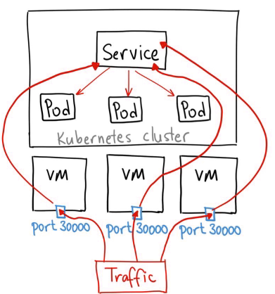
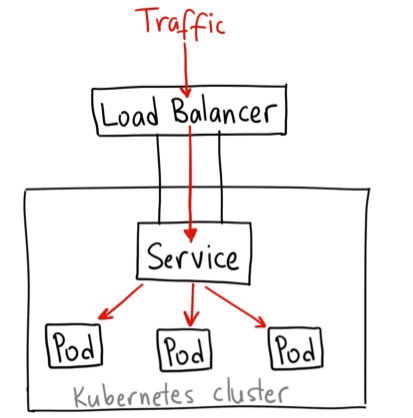
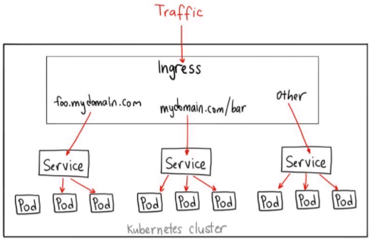

# 服务发布

Kubernetes提供了强大的服务编排能力，微服务化应用的每一个组件都以Service进行抽象，组件和组件之间只需要访问Service即可以互相通信，而无须感知组件的集群变化。同时Kubernetes 为Service提供了服务发现的能力，组件和组件之间可以简单地互相发现.

在Kubernetes中，服务和Pod的IP地址仅可以在集群网络内部使用, 集群外部默认不能访问service ip。若需要外部访问service，Kubernetes提供了NodePort Service、LoadBalancer Service和Ingress可以发布Service

- NodePort ： 在每个Node上分配一个端口作为外部访问入口
- LoadBalancer ：工作在特定的Cloud Provider上，例如Google Cloud，AWS，OpenStack
- Ingress

## ClusterIP

ClusterIP 服务是 Kubernetes 的默认服务。它给你一个集群内的服务，集群内的其它应用都可以访问该服务。集群外部无法访问它。

``` yaml
apiVersion: v1
kind: Service
metadata:  
  name: my-internal-service
selector:
  app: my-app
spec:
  type: ClusterIP
  ports:  
  - name: http
    port: 80
    targetPort: 80
    protocol: TCP
```

但可以通过 Kubernetes 的 proxy 模式 `$ kubectl proxy --port=8080`来访问该服务


这样你可以通过Kubernetes API，使用如下模式来访问这个服务：

`http://[k8s-master]:8080/api/v1/namespaces/[namespace-name]/services/[service-name]/proxy`

`e.g. http://localhost:8080/api/v1/namespaces/default/services/myweb/proxy`

这种方式仅用于开发环境，调试服务

## NodePort

NodePort 服务是引导外部流量到你的服务的最原始方式。NodePort，正如这个名字所示，在所有节点（虚拟机）上开放一个特定端口，任何发送到该端口的流量都被转发到对应服务



```yaml
apiVersion: v1
kind: Service
metadata:  
  name: my-nodeport-service
selector:
  app: my-app
spec:
  type: NodePort
  ports:  
  - name: http
    port: 80  #供集群中其它服务访问的端口
    targetPort: 80 # 后端pod中container暴露的端口
    nodePort: 30036
    protocol: TCP
```

NodePort 区别于普通的“ClusterIP”,它的服务类型是“NodePort”, 同时有一个额外的端口，称为 nodePort，它指定节点上开放的端口值 。如果你不指定这个端口，系统将选择一个随机端口。

**缺点：**

1. 每个端口只能是一种服务
2. 端口范围只能是 30000-32767
3. 如果节点/VM 的 IP 地址发生变化，需要能处理这种情况

不建议在生产环境上用这种方式暴露服务，一般用于demo应用

## LoadBalancer

LoadBalancer在NodePort基础上，K8S可以请求底层云平台创建一个负载均衡器，将每个Node作为后端，进行服务分发。该模式需要底层云平台（例如GCE）支持。



这个方式的最大缺点是每一个用 LoadBalancer 暴露的服务都会有它自己的 IP 地址，每个用到的 LoadBalancer 都需要付费，这将是非常昂贵的

## Ingress

Ingress 事实上不是一种服务类型。相反，它处于多个服务的前端，扮演着“智能路由”或者集群入口的角色。例如，你可以将任何发往域名 foo.yourdomain.com 的流量转到 foo 服务，将路径 yourdomain.com/bar/path 的流量转到 bar 服务。



``` yaml
apiVersion: extensions/v1beta1
kind: Ingress
metadata:
  name: my-ingress
spec:
  backend:
    serviceName: other
    servicePort: 8080
  rules:
  - host: foo.mydomain.com
    http:
      paths:
      - backend:
          serviceName: foo
          servicePort: 8080
  - host: mydomain.com
    http:
      paths:
      - path: /bar/*
        backend:
          serviceName: bar
          servicePort: 8080
```

Ingress 可能是暴露服务的最强大方式，但同时也是最复杂的。Ingress 控制器有各种类型，包括 Google Cloud Load Balancer， Nginx，Contour，Istio，等等。它还有各种插件，比如 cert-manager，它可以为你的服务自动提供 SSL 证书。

如果你想要使用同一个 IP 暴露多个服务，这些服务都是使用相同的七层协议（典型如 HTTP），那么Ingress 就是最有用的。
