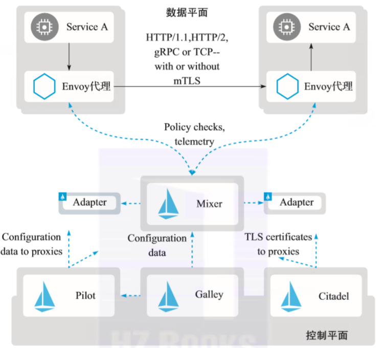

# istio

[TOC]

## Istio 是什么

istio 是由 Google、IBM、Lyft 等共同开源的 Service Mesh（服务网格）框架，于2017年初开始进入大众视野。`Kubernetes 解决了云原生应用的部署问题，istio 解决的是应用的服务（流量）治理问题。`

- <https://istio.io/zh/docs/concepts/what-is-istio/>

随着微服务出现，微服务的连接、管理和监控成为难题。Kubernetes 可以处理多个容器的工作负载，但当涉及更复杂的需求时，需要像Istio这样的微服务网格。

## 服务网格（Service Mesh）

服务网格（Service Mesh）这个术语通常用于描述构成这些应用程序的微服务网络以及应用之间的交互。随着规模和复杂性的增长，服务网格越来越难以理解和管理。它的需求包括服务发现、负载均衡、故障恢复、指标收集和监控以及通常更加复杂的运维需求，例如 A/B 测试、金丝雀发布、限流、访问控制和端到端认证等。

Istio 提供了一个完整的解决方案，通过为整个服务网格提供行为洞察和操作控制来满足微服务应用程序的多样化需求。

## Istio 架构

从架构设计上来看，Istio 服务网格逻辑上分为`数据平面`和`控制平面`。

- 数据平面由一组以 sidecar 方式部署的智能代理（Envoy）组成。这些代理可以调节和控制微服务及 Mixer 之间所有的网络通信。
- 控制平面负责管理和配置代理来路由流量。此外控制平面配置 Mixer 以实施策略和收集遥测数据。

作为代理，Envoy非常适合服务网格的场景，但要发挥Envoy的最大价值，就需要使它很好地与底层基础设施或组件紧密配合。Envoy构成了服务网格的数据平面，Istio提供的支撑组件则是创建了控制平面。

### Envoy

Envoy 是以 C++ 开发的高性能代理，用于调解服务网格中所有服务的所有入站和出站流量。Envoy 的许多内置功能被 istio 发扬光大，例如：

- 动态服务发现
- 负载均衡
- TLS 终止
- HTTP/2 & gRPC 代理
- 熔断器
- 健康检查、基于百分比流量拆分的灰度发布
- 故障注入
- 丰富的度量指标

Envoy 被部署为 `sidecar`，和对应服务在同一个 Kubernetes pod 中。这允许 Istio 将大量关于流量行为的信号作为属性提取出来，而这些属性又可以在 Mixer 中用于执行策略决策，并发送给监控系统，以提供整个网格行为的信息。

Sidecar 代理模型还可以将 Istio 的功能添加到现有部署中，而无需重新构建或重写代码。可以阅读更多来了解为什么我们在设计目标中选择这种方式。

### Mixer

Mixer 是一个独立于平台的组件，负责在服务网格上执行访问控制和使用策略，并从 Envoy 代理和其他服务收集遥测数据。代理提取请求级属性，发送到 Mixer 进行评估。有关属性提取和策略评估的更多信息，请参见 Mixer 配置。

Mixer 中包括一个灵活的插件模型，使其能够接入到各种主机环境和基础设施后端，从这些细节中抽象出 Envoy 代理和 Istio 管理的服务。

### Pilot

Pilot 为 Envoy sidecar 提供服务发现功能，为智能路由（例如 A/B 测试、金丝雀部署等）和弹性（超时、重试、熔断器等）提供流量管理功能。它将控制流量行为的高级路由规则转换为特定于 Envoy 的配置，并在运行时将它们传播到 sidecar。

Pilot 将平台特定的服务发现机制抽象化并将其合成为符合 Envoy 数据平面 API 的任何 sidecar 都可以使用的标准格式。这种松散耦合使得 Istio 能够在多种环境下运行（例如，Kubernetes、Consul、Nomad），同时保持用于流量管理的相同操作界面。

### Citadel

Citadel 通过内置身份和凭证管理可以提供强大的服务间和最终用户身份验证。可用于升级服务网格中未加密的流量，并为运维人员提供基于服务标识而不是网络控制的强制执行策略的能力。从 0.5 版本开始，Istio 支持基于角色的访问控制，以控制谁可以访问您的服务。

## Istio Sidecar Proxy

Cluster IP解决了服务之间相互访问的问题，但从上面Kube-proxy的三种模式可以看到，Cluster IP的方式只提供了服务发现和基本的LB功能。如果要为服务间的通信应用灵活的路由规则以及提供Metrics collection，distributed tracing等服务管控功能,就必须得依靠Istio提供的服务网格能力了。

在Kubernetes中部署Istio后，Istio通过iptables和Sidecar Proxy接管服务之间的通信，服务间的相互通信不再通过Kube-proxy，而是通过Istio的Sidecar Proxy进行。请求流程是这样的：Client发起的请求被iptables重定向到Sidecar Proxy，Sidecar Proxy根据从控制面获取的服务发现信息和路由规则，选择一个后端的Server Pod创建链接，代理并转发Client的请求。

Istio Sidecar Proxy 和Kube-proxy的userspace模式的工作机制类似，都是通过在用户空间的一个代理来实现客户端请求的转发和后端多个Pod之间的负载均衡。**两者的不同点是：Kube-Proxy工作在四层，而Sidecar Proxy则是一个七层代理，可以针对HTTP，GRPS等应用层的语义进行处理和转发，因此功能更为强大，可以配合控制面实现更为灵活的路由规则和服务管控功能**

在Istio服务网格中，通过为每个Service部署一个sidecar代理，Istio接管了Service之间的请求流量。控制面可以对网格中的所有sidecar代理进行统一配置，实现了对网格内部流量的路由控制，从而可以实现灰度发布，流量镜像，故障注入等服务管控功能。但是，Istio并没有为入口网关提供一个较为完善的解决方案

