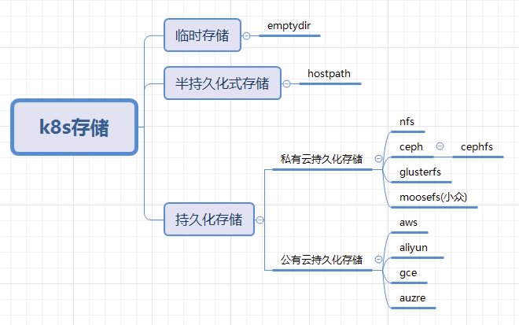
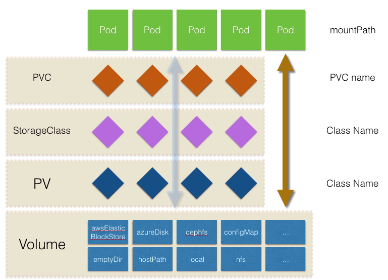

# Kubernetes 存储系统 Storage

容器中的存储都是临时的，因此Pod重启的时候，内部的数据会发生丢失。实际应用中，我们有些应用是无状态，有些应用则需要保持状态数据，确保Pod重启之后能够读取到之前的状态数据，有些应用则作为集群提供服务。这三种服务归纳为无状态服务、有状态服务以及有状态的集群服务，其中后面两个存在数据保存与共享的需求，因此就要采用容器外的存储方案。

Kubernetes的存储中有四个重要的概念：`Volume、PersistentVolume(PV)、PersistentVolumeClaim(PVC)、StorageClass`。掌握了这四个概念，就掌握了Kubernetes中存储系统的核心。用一张图来说明这四者之间的关系。

- Volumes是最基础的存储抽象，其支持多种类型，包括本地存储、NFS、FC以及众多的云存储，我们也可以编写自己的存储插件来支持特定的存储系统。Volume可以被Pod直接使用，也可以被PV使用。普通的Volume和Pod之间是一种静态的绑定关系，在定义Pod的同时，通过volume属性来定义存储的类型，通过volumeMount来定义容器内的挂载点。

- PersistentVolume。与普通的Volume不同，PV是Kubernetes中的一个资源对象，创建一个PV相当于创建了一个存储资源对象，这个资源的使用要通过PVC来请求。

- PersistentVolumeClaim。PVC是用户对存储资源PV的请求，根据PVC中指定的条件Kubernetes动态的寻找系统中的PV资源并进行绑定。

- StorageClass: 为管理员提供了一种描述他们提供的存储的“类”的方法。 不同的类可能映射到服务质量级别，或备份策略，或者由群集管理员确定的任意策略