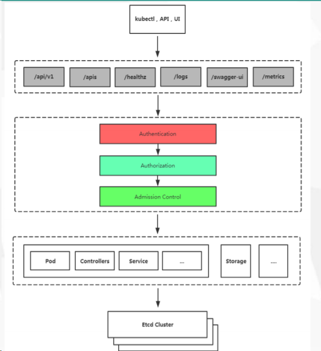

# Kubernetes 安全机制

[TOC]

## API Server 安全访问机制

在K8s中我们操作任何资源都需要经历三个检查步骤：`认证、授权 和 准入控制`。当然这些仅针对普通用户，`k8s中默认clusteradmin是拥有最高权限的。`

- 认证: 即用户要登陆k8s上操作资源，你必须提供合法的用户名和密码。
- 授权: 用户认证通过后，要查看该用户能操作什么资源，若其要操作的资源在其允许操作的资源范围内则通过。
- 准入控制: 用户要操作的资源，也许需要级联其它相关资源或级联了其它相关操作，那么这些级联的资源 或 级联的操作该用户是否有权限访问？这个就是有准入控制来检查的，若不允许访问级联资源，那么该资源也将无法访问。



## 1. 认证 (Authentication)

三种客户端身份认证：

1. HTTPS 证书认证：基于CA证书签名的数字证书认证

此时K8s服务端 和 客户端要做双向证书认证，即客户端要认证服务端的证书是否为自己认可的CA所签发的证书，且证书中的subject信息CN(主机名)必须与服务端的主机名一致，等等；而服务器端也要认证客户端的证书，也要认可签发该证书的CA，以及证书中的信息也要匹配。

例如：kubelet 连接kube-apiserver、kube-proxy连接 kube-apiserver 均采用 https传输方式

``` shell
user@k8s-master:/etc/kubernetes$ sudo cat kubelet.conf|grep pem
    client-certificate: /var/lib/kubelet/pki/kubelet-client-current.pem
    client-key: /var/lib/kubelet/pki/kubelet-client-current.pem
```

2. HTTP Token认证：通过一个Token来识别用户

    客户端携带一个token来请求server端，如果server端含有这个token，那么认证成功否则失败

3. HTTP Base认证：用户名+密码的方式认证

    比较原始的方式，在k8s中基本很少使用

## 2. 授权 (Authorization)

在Kubernetes中，授权有`ABAC（基于属性的访问控制）、RBAC（基于角色的访问控制）、Webhook、Node、AlwaysDeny（一直拒绝）和AlwaysAllow（一直允许）`这6种模式

它也是模块化设计,它和认证一样都同时支持多个模块并存，但只要有一个模块认证通过，即通过了此关，可进入下一关进一步检查。

除了下面几种常用授权模块，我们也可在测试时，使用“总是允许” 或 “总是拒绝”来测试账号。

- RBAC：基于角色的访问控制机制，它只有允许授权，没有拒绝授权，因为默认是拒绝所有，我们仅需要定义允许该用户做什么即可。默认kubectl创建的K8s资源，都是默认启用强制RBAC的

- ABAC: 基于属性的访问控制

- 基于Node的授权

- Web-huke的授权（这是一种通过Web的回调机制实现的授权)

## 3. 准入控制

Adminssion Control实际上是一个准入控制器插件列表，发送到API Server的请求都需要经过这个列表中的每个准入控制器 插件的检查，检查不通过，则拒绝请求。

``` yaml
$ sudo cat /etc/kubernetes/manifests/kube-apiserver.yaml
apiVersion: v1
kind: Pod
metadata:
  annotations:
    kubeadm.kubernetes.io/kube-apiserver.advertise-address.endpoint: 192.168.39.208:8443
  creationTimestamp: null
  labels:
    component: kube-apiserver
    tier: control-plane
  name: kube-apiserver
  namespace: kube-system
spec:
  containers:
  - command:
    - kube-apiserver
    - --advertise-address=192.168.39.208
    - --allow-privileged=true
    - --authorization-mode=Node,RBAC
    - --client-ca-file=/var/lib/minikube/certs/ca.crt
    - --enable-admission-plugins=NamespaceLifecycle,LimitRanger,ServiceAccount,DefaultStorageClass,DefaultTolerationSeconds,NodeRestriction,MutatingAdmissionWebhook,ValidatingAdmissionWebhook,ResourceQuota
```

## 账号类型

K8S中有两种用户(User)：`服务账号(ServiceAccount)`和`普通的用户(User)`。 ServiceAccount 是由 k8s 管理的，而 User 账号是在外部管理，k8s 不存储用户列表，也就是说针对用户的增、删、该、查都是在集群外部进行，k8s 本身不提供普通用户的管理。

两种账号的区别：

- ServiceAccount 是 k8s 内部资源，而普通用户是存在于 k8s 之外的；
- ServiceAccount 是属于某个命名空间的，不是全局的，而普通用户是全局的，不归某个 namespace 特有；
- ServiceAccount 一般用于集群内部 Pod 进程使用，和 api-server 交互，而普通用户一般用于 kubectl 或者 REST 请求使用；