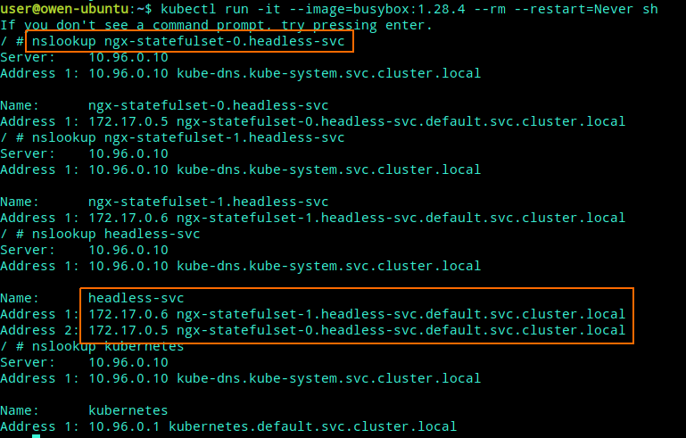

# SatefulSet

[TOC]

StatefulSet是Kubernetes提供的管理有状态应用的负载管理控制器API。在Pods管理的基础上，保证Pods的顺序和一致性。与Deployment一样，StatefulSet也是使用容器的Spec来创建Pod，但是StatefulSet创建的Pods需要`持久保留状态`，且有编号区分。

**无状态:**

1. deployment认为所有的pod都是一样的
2. 不用考虑顺序的要求
3. 不用考虑在哪个node节点上运行
4. 可以随意扩容和缩容

**有状态：**

- 实际场景中，尤其是分布式应用，多个实例之间(e.g. Mysql集群、MongoDB集群、ZooKeeper集群)，往往有依赖关系，比如：主从关系、主备关系。对于数据存储类应用，它的多个实例，往往都会在本地磁盘保存一份数据。导致这些实例一旦被杀掉，即便重建出来，实例与数据之间的对应关系也已经丢失，从而导致应用创建失败。

- 这种实例之间有不对等关系，以及实例对外部数据有依赖关系的应用，称为“有状态应用”

## SatefulSet 特性

- StatefulSet里的每个Pod都有稳定、唯一的网络标识 `$(statefulset名称)-$(序号)`，可以用来发现集群内的其他成员.假设 StatefulSet 的名字叫 kafka，那么第1个Pod叫 kafka-0，第2个叫kafka-1，以此类推

- StatefulSet控制的Pod副本的启停顺序是受控的，有序部署（即0到N-1），有序伸缩（即从N-1到0），创建一个Pod时，它的前1个Pod已经是运行且准备好的状态

- StatefulSet 里的 Pod 采用稳定的持久化存储卷，通过 PV/PVC 来实现，删除 Pod 时默认不会删除与StatefulSet 相关的存储卷（为了保证数据的安全）

## 相关知识概念

SatefulSet 涉及到一些其他概念和知识（特别是k8s存储），这里先提前介绍下有个认知，随后会在其他章节详细介绍。

### Headless Service

StatefulSet 除了要与PV卷捆绑使用以存储 Pod 的状态数据，还要与 Headless Service(无头服务) 配合使用。

**普通Service：** 一组Pod访问策略，提供cluster-IP群集之间通讯，还提供负载均衡和服务发现。

**Headless Service：**  不需要cluster-IP (值为None)，直接绑定具体的Pod的IP, 这个Service被创建后并不会分配一个VIP，而是以DNS记录的方式暴露它所代理的Pod。无头服务经常用于statefulset的有状态部署
  
  当按照这样的方式创建了一个Headless Service后，它所代理的所有Pod的IP地址，都会被绑定一个如下格式的DNS记录，如下：

   `<pod-name>.<svc-name>.<namespace>.svc.cluster.local`

   这条DNS记录，是Kubernetes为Pod分配的唯一“可解析身份”

   比如一个 3 节点的 kafka 的 StatefulSet 集群，对应的 Headless Service 的名字为 kafkasvc，StatefulSet 的名字为kafka，则 StatefulSet 里面的 3 个 Pod 的 DNS 名称分别为kafka-0.kafkasvc、kafka-1.kafkasvc、kafka-2.kafkasvc，这些DNS 名称可以直接在集群的配置文件中固定下来

### SatefulSet、Volume、PVC、PV之间的关系

- volume是pod中用来挂在文件到容器中用的，支持多种的volume类型挂在，其中包括hostpath,emptydir,ceph-rbd等，，volume可以说是一个存储挂载的桥梁啦，可以通过volume关联中的persistentVolumeClaim关联pvc，然后用pvc关联的pv的存储。

- pv（persistentVolume）是用来向真正的存储服务器申请真正的存储资源的一个object，至于这个存储资源谁来用，那就是接下来说的pvc的职责所在。

- pvc（persistentVolumeClaim）就是用来关联pv和pod的一个桥梁

- statefulset 就是对应的存储的真正消费者，关联pv的方式用pvc
  1. 在你容器中的volumeMount中指定对应的pvc的名字
  2. 或者可以通过pod中volume关联中的persistentVolumeClaim关联pvc

## StatefulSet 设计思路

StatefulSet 将应用状态抽象成了两种情况：

- **拓扑状态:** 应用实例必须按照某种顺序启动
  
  比如: 应用的主节点 A 要先于从节点 B 启动，如果把 A 和 B 两个 Pod 删除掉，它们再次被创建出来时也必须严格按照这个顺序才行; 同时新创建出来的 Pod，必须和原来 Pod 的网络标识一样，这样原先的访问者才能使用同样的方法，访问到这个新 Pod。

- **存储状态:** 应用的多个实例分别绑定了不同存储数据
  - 应用的多个实例分别绑定了不同的存储数据。
  - 对于这些应用实例来说，Pod A 第一次读取到的数据，和重建后读取的数据应该是同一份

StatefulSet 的核心功能就是通过某种方式记录这些状态，在 Pod 被重建时，能够为新 Pod 恢复这些状态。

### 拓扑状态

**StatefulSet示例如下:**

``` yaml
apiVersion: v1
kind: Service
metadata:
  name: headless-svc
spec:
  clusterIP: None       # 这是一个Headless Service
  ports:
  - port: 80
  selector:
    app: nginx

---

apiVersion: apps/v1
kind: StatefulSet
metadata:
  name: ngx-statefulset
spec:
  serviceName: headless-svc     # 使用这个Headless Service来保证
  replicas: 2
  selector:
    matchLabels:
      app: nginx
  template:
    metadata:
      labels:
        app: nginx
    spec:
      containers:
      - name: nginx
        image: nginx:latest
        ports:
        - name: web-service
          containerPort: 80
```


使用带有nslookup命令的busybox镜像启动一个Pod，测试一下这两个Pod的 "唯一网络标识"，验证DNS解析

`kubectl run -it --image=busybox:1.28.4 --rm --restart=Never sh`

  

**总结：**

- StatefulSet 为每个 Pod 副本创建了一个 DNS 域名，这个域名的格式为： `$(podname).(headless servername)`，也就意味着服务间是通过Pod域名来通信而非Pod IP，因为当Pod所在Node发生故障时， Pod 会被飘移到其它 Node 上，Pod IP 会发生变化，但是 Pod 域名不会有变化

- StatefulSet 使用 Headless 服务来控制 Pod 的域名，这个域名的 FQDN 为：`$(servicename).$(namespace).svc.cluster.local`，其中，“cluster.local” 指的是集群的域名。 根据 volumeClaimTemplates，为每个 Pod 创建一个 pvc，pvc 的命名则匹配模式：`(volumeClaimTemplates.name)-(pod_name)`，比如上面的volumeMounts.name=www， Podname=web-[0-2]，因此创建出来的 PVC 是 www-web-0、www-web-1、www-web-2

### 存储状态

StatefulSet 对存储状态的管理，主要使用的是 PersistentVolume 的功能

``` yaml
apiVersion: apps/v1
kind: StatefulSet
metadata:
  name: ngx-statefulset
spec:
  serviceName: headless-svc         # 使用这个Headless Service来保证
  replicas: 2
  selector:
    matchLabels:
      app: nginx
  template:
    metadata:
      labels:
        app: nginx
    spec:
      containers:
      - name: nginx
        image: nginx:latest
        ports:
        - name: web-service
          containerPort: 80
        volumeMounts:
          - name: mypvc
            mountPath: /usr/share/nginx/html
  volumeClaimTemplates:    # PVC模板,作用类似于Pod模板, 用于创建PVC
  - metadata:
      name: mypvc
    spec:
      storageClassName: standard
      accessModes:
      - ReadWriteMany
      resources:
        requests:
          storage: 1Gi
```

**说明：**

`volumeClaimTemplates` 跟Deployment里 Pod 模板的作用类似。凡是被这个 StatefulSet 管理的 Pod，都会声明一个对应的 PVC；而这个 PVC 的定义，就来自于 volumeClaimTemplates 这个模板字段。这个 PVC 的名字，会被分配一个与这个 Pod 完全一致的编号。

- 当自动创建的PVC与PV绑定成功后，就会进入Bound状态，这就意味着这个Pod可以挂载并使用这个PV了。
- 当然前提是要有足够的满足需求的PV , 以及与PV相应的储存资源。


可以看到，这些 PVC，都以 `<PVC名字 >-<StatefulSet名字 >-<编号>` 的方式命名，并且处于 Bound 状态。

在这两个Pod绑定的volume里写入不同的内容, 再手动delete掉这两个Pod, 待Pod被重建后, 再次查看它们所绑定的volume中的内容, 会发现依然没有任何变化

### StatefulSet控制器恢复Pod的过程

1. 当Pod被删除之后，这个Pod对应的PVC和PV及它们的绑定关系并不会被删除(这点通过PV/PVC的"AGE"字段可以看出)，因此PV所对应的存储资源中所存储的内容当然也不会有任何改变；

2. StatefulSet控制器发现Pod消失了，它就会试图重建 Pod；
3. 重建的Pod还是叫同样的名字, 按照同样的顺序来创建；
4. 重建Pod时PVC也叫同样的名字, 因之前的PVC保留着, 所以直接挂载使用。

## 总结

1. StatefulSet 的控制器直接管理的是 Pod。这是因为，StatefulSet 里的不同 Pod 实例，不再像 ReplicaSet 中那样都是完全一样的，而是有了细微区别的。比如，每个 Pod 的 hostname、名字等都是不同的、携带了编号的。而 StatefulSet 区分这些实例的方式，就是通过在 Pod 的名字里加上事先约定好的编号。

2. Kubernetes 通过 Headless Service，为这些有编号的 Pod，在 DNS 服务器中生成带有同样编号的 DNS 记录。只要 StatefulSet 能够保证这些 Pod 名字里的编号不变，那么 Service 里类似于 web-0.nginx.default.svc.cluster.local 这样的 DNS 记录也就不会变，而这条记录解析出来的 Pod 的 IP 地址，则会随着后端 Pod 的删除和再创建而自动更新。这当然是 Service 的能力，不需要 StatefulSet 操心。

3. StatefulSet 为每一个 Pod 分配并创建一个同样编号的 PVC。这样，Kubernetes 就可以通过 Persistent Volume 机制为这个 PVC 绑定上对应的 PV，从而保证了每一个 Pod 都拥有一个独立的 Volume。在这种情况下，即使 Pod 被删除，它所对应的 PVC 和 PV 依然会保留下来。所以当这个 Pod 被重新创建出来之后，Kubernetes 会为它找到同样编号的 PVC，挂载这个 PVC 对应的 Volume，从而获取到以前保存在 Volume 里的数据。
