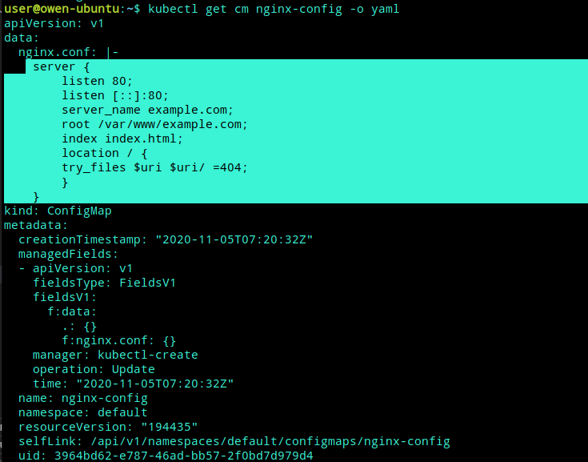
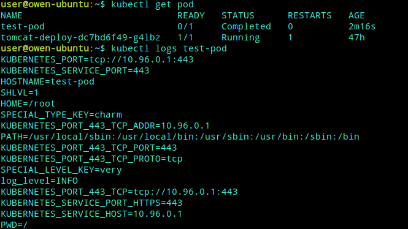

# ConfigMap

[TOC]

ConfigMap是k8s的一个配置管理组件，可以将配置以key-value的形式传递，通常用来保存不需要加密的配置信息，加密信息则需用到Secret(为Pod提供密码、Token、私钥等敏感数据)，主要用来应对以下场景：

1. 使用k8s部署应用，当你将应用配置写进代码中，就会存在一个问题，更新配置时也需要打包镜像，configmap可以将配置信息和docker镜像解耦。
2. 使用微服务架构的话，存在多个服务共用配置的情况 (适应实际开发中不同的环境配置)，如果每个服务中单独一份配置的话，那么更新配置就很麻烦，使用configmap可以友好的进行配置共享。

其次，configmap可以用来保存单个属性，也可以用来保存配置文件。

## 创建ConigMap

可以使用 kubectl create configmap 从文件、目录或者 key-value 字符串创建等创建 ConfigMap。也可以通过 kubectl create -f从描述文件创建。

常见创建方式：

### 1. 通过yaml / json文件创建

`$ kubectl create  -f  config.yaml`

``` yaml
apiVersion: v1
kind: ConfigMap
metadata:
  name: special-config
data:
  special.how: very
  special.type: charm
```

``` yaml
kind: ConfigMap
apiVersion: v1
metadata:
  name: cm-demo
  namespace: default
data:
  nginx-c: "server {
   listen       8081;         ##端口为8081
   server_name  _;
   root         /html;         ##改数据目录为/html

   location / {
   }

}"
```

注意：nginx-c是configmap里的key，里面的配置需要用双引号引起来。

### 2. 通过--from-file 创建

分别指定单个文件和目录，指定目录可以创建一个包含该目录中所有文件的configmap：

`kubectl create configmap *** --from-file=file1 #从单个文件中创建：`

`kubectl create configmap *** --from-file=file1 --from-file=file2 # --from-file可以使用多次`

如下：

`kubectl create configmap nginx-config --from-file=./nginx.conf`



### 3. 通过key-value字符串创建

`kubectl create configmap test-config --from-literal=env_model=prd -n test`

### 4. 通过env文件创建

`kubectl create configmap *** --from-env-file=env.txt`

e.g.

``` shell
echo -e "a=b\nc=d" | tee config.env
kubectl create configmap special-config --from-env-file=config.env
```

## 使用ConigMap

Pod可以通过三种方式来使用ConfigMap，分别为：

- 将ConfigMap中的数据设置为环境变量
- 将ConfigMap中的数据设置为命令行参数
- 使用Volume将ConfigMap作为文件或目录挂载

**注意：**

- ConfigMap必须在pod之前创建
- configmap受namespace的限制，只能相同namespace的pod才可以引用

### 1. 用作环境变量

首先创建两个ConfigMap，分别名为special-config和env-config：

``` shell
kubectl create configmap special-config --from-literal=special.how=very --from-literal=special.type=charm

kubectl create configmap env-config --from-literal=log_level=INFO
```

然后以环境变量方式引用：

``` yaml
apiVersion: v1
kind: Pod
metadata:
  name: test-pod
spec:
  containers:
    - name: test-container
      image: busybox
      command: [ "/bin/sh", "-c", "env" ]
      env:
        - name: SPECIAL_LEVEL_KEY
          valueFrom:
            configMapKeyRef:
              name: special-config
              key: special.how
        - name: SPECIAL_TYPE_KEY
          valueFrom:
            configMapKeyRef:
              name: special-config
              key: special.type
      envFrom:
        - configMapRef:
            name: env-config
  restartPolicy: Never
```

当pod运行结束后，它的输出如下



### 2. 用作命令行参数

将ConfigMap用作命令行参数时，需要先把ConfigMap的数据保存在环境变量中，然后通过$(VAR_NAME)的方式引用环境变量

``` yaml
apiVersion: v1
kind: Pod
metadata:
  name: dapi-test-pod
spec:
  containers:
    - name: test-container
      image: busybox
      command: [ "/bin/sh", "-c", "echo $(SPECIAL_LEVEL_KEY) $(SPECIAL_TYPE_KEY)" ]
      env:
        - name: SPECIAL_LEVEL_KEY
          valueFrom:
            configMapKeyRef:
              name: special-config
              key: special.how
        - name: SPECIAL_TYPE_KEY
          valueFrom:
            configMapKeyRef:
              name: special-config
              key: special.type
  restartPolicy: Never

```

### 3. 使用volume将ConfigMap作为文件或目录直接挂载

#### 每个key生成单独文件名 进行挂载

将创建的ConfigMap直接挂载至Pod的/etc/config目录下，其中每一个key-value键值对都会生成一个文件，key为文件名，value为内容。

``` yaml
apiVersion: v1
kind: Pod
metadata:
  name: vol-test-pod
spec:
  containers:
    - name: test-container
      image: busybox
      command: [ "/bin/sh", "-c", "cat /etc/config/special.how" ]
      volumeMounts:
      - name: config-volume
        mountPath: /etc/config
  volumes:
    - name: config-volume
      configMap:
        name: special-config
  restartPolicy: Never
```

如下所示：

``` shell
/ # ls /etc/config
special.how   special.type
/ # ls /etc/config/special.how
/etc/config/special.how
/ # cat /etc/config/special.how
/ # cat /etc/config/special.type
charm/ # exit

```

#### 指定某个key作为文件进行挂载 （同名覆盖）

将创建的ConfigMap中special.how这个key挂载到/etc/config目录下的一个相对路径/keys/special.level。如果存在同名文件，直接覆盖。其他的key不挂载。

``` yaml
apiVersion: v1
kind: Pod
metadata:
  name: dapi-test-pod
spec:
  containers:
    - name: test-container
      image: busybox
      command: [ "/bin/sh","-c","cat /etc/config/keys/special.level" ]
      volumeMounts:
      - name: config-volume
        mountPath: /etc/config
  volumes:
    - name: config-volume
      configMap:
        name: special-config
        items:  # 指定某个key作为文件进行挂载
        - key: special.how
          path: keys/special.level
  restartPolicy: Never
```

结果如下:

``` shell
user@owen-ubuntu:~$ kubectl exec -it dapi-test-pod2 -- /bin/sh
/ # ls /etc/config/
keys
/ # ls /etc/config/keys
special.level
/ # cat /etc/config/keys/special.level
very/
```

#### 指定某个key作为文件进行挂载 （不覆盖）

在一般情况下 configmap 挂载文件时，会先覆盖掉挂载目录，然后再将 congfigmap 中的内容作为文件挂载进行。如果想不对原来的文件夹下的文件造成覆盖，只是将 configmap 中的每个 key，按照文件的方式挂载到目录下，可以使用 subpath 参数。

``` yaml
apiVersion: v1
kind: Pod
metadata:
  name: dapi-test-pod
spec:
  containers:
    - name: test-container
      image: nginx
      command: ["/bin/sh","-c","sleep 36000"]
      volumeMounts:
      - name: config-volume
        mountPath: /etc/nginx/special.how
        subPath: special.how  # 指定某个key作为文件进行挂载 （不覆盖）
  volumes:
    - name: config-volume
      configMap:
        name: special-config
        items:
        - key: special.how
          path: special.how
  restartPolicy: Never
```

结果如下：

``` shell
/etc/nginx
# ls
conf.d fastcgi_params koi-utf  koi-win  mime.types  modules  nginx.conf  scgi_params special.how  uwsgi_params  win-utf
# pwd
/etc/nginx
# cat special.how
very#

```