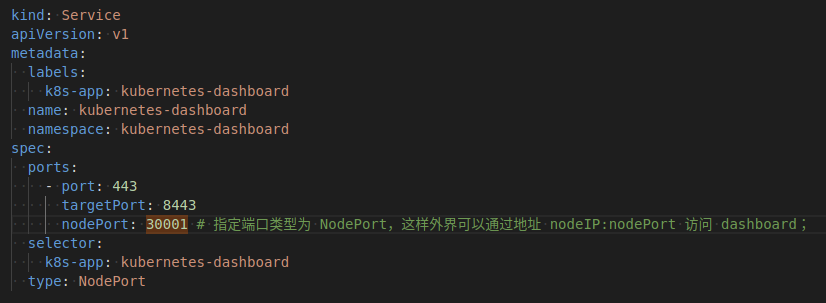
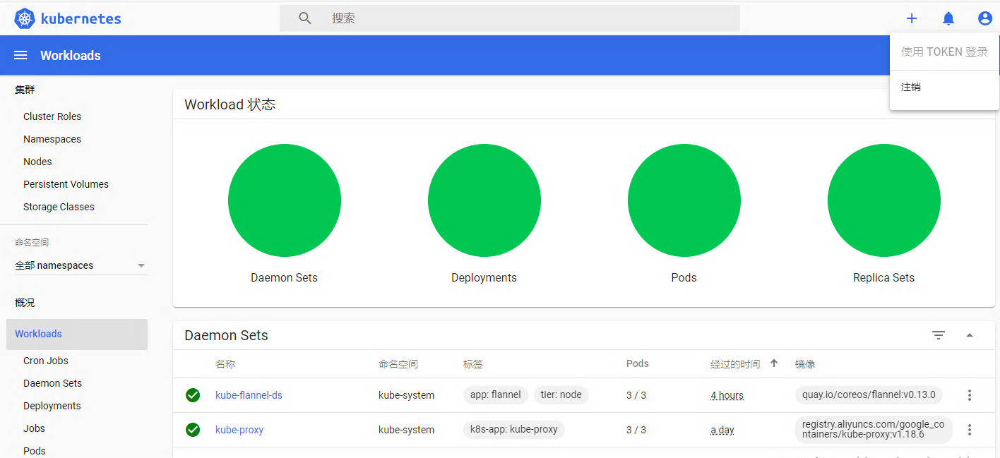

# kubernetes-dashboard

[TOC]

Kubernetes Dashboard 是 k8s集群的一个 WEB UI管理工具. 通过基于Web的仪表板，你可以将容器化应用程序部署到Kubernetes集群并进行故障排除。部署完后，你还可以完整地管理群集及其所有资源。

- https://kubernetes.io/docs/tasks/access-application-cluster/web-ui-dashboard/

## 安装 k8s-dashboard

### 1. 下载官方的yaml文件

进入官网：<https://kubernetes.io/docs/tasks/access-application-cluster/web-ui-dashboard/>

`wget https://raw.githubusercontent.com/kubernetes/dashboard/v2.0.0/aio/deploy/recommended.yaml`

### 2. 修改yaml文件

理论上，可以直接执行下载的yaml

`kubectl apply -f https://raw.githubusercontent.com/kubernetes/dashboard/v2.0.0/aio/deploy/recommended.yaml`

然后通过执行 `kubectl proxy` 访问 `http://localhost:8001/api/v1/namespaces/kubernetes-dashboard/services/https:kubernetes-dashboard:/proxy/`  （注意：该方式只能在执行命令的当前机器访问）

所以，为了暴露服务，需要对上述yaml一些小的改动, 添加type: Nodeport 和nodePort: 30001，通过 `NodePort` 支持外部访问



### 3. 安装 dashboard

下载修改过的[k8s-dashboard.yaml](https://git.devopsing.site/devops/-/blob/master/k8s/k8s-dashboard.yaml), 执行如下命令

`kubectl apply -f k8s-dashboard.yaml`

如下，dashboard服务已经创建成功


访问 `https://Node-IP:NodePort` 即可看到 k8s仪表盘 (由于 dashboard 默认是自建的 https 证书，该证书是不受浏览器信任的，所以我们需要强制跳转就可以了。)


## 身份认证

登录 dashboard 的时候支持 Kubeconfig 和token 两种认证方式，Kubeconfig 中也依赖token 字段，所以生成token 这一步是必不可少的。

### 1. 授予dashboard账户集群管理权限

执行 `kubectl apply -f  kubernetes-dashboard-admin.rbac.yaml`

使用下面的yaml文件创建admin用户并赋予他管理员权限，然后就可以通过token 登陆dashbaord，这种认证方式本质实际上是通过Service Account 的身份认证加上Bearer token请求 API server 的方式实现

```yaml

#创建一个叫admin-user的服务账号:
apiVersion: v1
kind: ServiceAccount
metadata:
  name: admin-user
  namespace: kubernetes-dashboard
---
#直接绑定admin角色:
apiVersion: rbac.authorization.k8s.io/v1
kind: ClusterRoleBinding
metadata:
  name: admin-user
roleRef:
  apiGroup: rbac.authorization.k8s.io
  kind: ClusterRole
  name: cluster-admin
subjects:
- kind: ServiceAccount
  name: admin-user
  namespace: kubernetes-dashboard
```

### 2. 获取token令牌的方式访问

获取token

`kubectl -n kubernetes-dashboard get secret | grep admin-user |awk '{print "secret/"$1}'|xargs kubectl describe -n kubernetes-dashboard|grep token:|awk -F : '{print $2}'|xargs echo`

``` text
user@k8s-master:~/owen-ops/k8s$ kubectl -n kubernetes-dashboard get secret | grep admin-user |awk '{print $1}'|xargs kubectl describe -n kubernetes-dashboard secret

Name:         admin-user-token-89rlc
Namespace:    kubernetes-dashboard
Labels:       <none>
Annotations:  kubernetes.io/service-account.name: admin-user
              kubernetes.io/service-account.uid: 0b79ad1f-7726-4d2c-b66f-838faf42bccf

Type:  kubernetes.io/service-account-token

Data
====
namespace:  20 bytes
token:      eyJhbGciOiJSUzI1NiIsImtpZCI6ImIzcjFUNFV0WkFUdkZrSk5kNjRiQ3ZjSEtrQmoyeHdqdUxEU29nRTJLa3cifQ.eyJpc3MiOiJrdWJlcm5ldGVzL3NlcnZpY2VhY2NvdW50Iiwia3ViZXJuZXRlcy5pby9zZXJ2aWNlYWNjb3VudC9uYW1lc3BhY2UiOiJrdWJlcm5ldGVzLWRhc2hib2FyZCIsImt1YmVybmV0ZXMuaW8vc2VydmljZWFjY291bnQvc2VjcmV0Lm5hbWUiOiJhZG1pbi11c2VyLXRva2VuLTg5cmxjIiwia3ViZXJuZXRlcy5pby9zZXJ2aWNlYWNjb3VudC9zZXJ2aWNlLWFjY291bnQubmFtZSI6ImFkbWluLXVzZXIiLCJrdWJlcm5ldGVzLmlvL3NlcnZpY2VhY2NvdW50L3NlcnZpY2UtYWNjb3VudC51aWQiOiIwYjc5YWQxZi03NzI2LTRkMmMtYjY2Zi04MzhmYWY0MmJjY2YiLCJzdWIiOiJzeXN0ZW06c2VydmljZWFjY291bnQ6a3ViZXJuZXRlcy1kYXNoYm9hcmQ6YWRtaW4tdXNlciJ9.UPL-K6AXP5mjkz9AogfN-bqMemm9OPUjac_S_UIor94c9tOOWTxjcD_-zkFrttikOgr2ycTXDcUZUSC7rXbICWUBcI_r5Q2ERBiM-P5l4FwmgbRFDM4xDlyk_lW7xnHvMGk4hraSst15UbWTMV_TG4O4HdWH1EDnTEkvZYB9D7Ke7hWmcEr2MUJjNJd3BrpZZrobubYCWPzS6YAYbL1AznZWyrr5oeVsvUGQrsA95otw47mtMOIobyrRjt7Q0o9yv5S40nuxQmK-e1pPDT1W6gZMhTEkAkK0UORIo9hHtz8Vcj3k9ym173x-aNknsudWna1Kl0XKlQ10JdVwvZYs0g
ca.crt:     1025 bytes

```

将令牌复制登录即可



### 3. 通过Kubeconfig访问

如果觉得每次粘贴token很麻烦，可以按照下面的步骤，生成 conf文件

``` shell
kubectl get secret -n kube-system|grep admin-user

DASH_TOCKEN=$(kubectl get secret -n kubernetes-dashboard admin-user-token-89rlc -o jsonpath={.data.token}|base64 -d)

#配置集群信息
kubectl config set-cluster kubernetes --server=172.20.249.16:6443 --kubeconfig=./dashbord-admin.conf
kubectl config set-credentials admin-user --token=$DASH_TOCKEN --kubeconfig=./dashbord-admin.conf
kubectl config set-context admin-user@kubernetes --cluster=kubernetes --user=admin-user --kubeconfig=./dashbord-admin.conf
kubectl config use-context admin-user@kubernetes --kubeconfig=./dashbord-admin.conf

```

生成后的config 文件如下

``` shell
user@k8s-master:~/owen-ops/k8s$ kubectl config view --kubeconfig=./dashbord-admin.conf
apiVersion: v1
clusters:
- cluster:
    server: 172.20.249.16:6443
  name: kubernetes
contexts:
- context:
    cluster: kubernetes
    user: admin-user
  name: admin-user@kubernetes
current-context: admin-user@kubernetes
kind: Config
preferences: {}
users:
- name: admin-user
  user:
    token: eyJhbGciOiJSUzI1NiIsImtpZCI6ImIzcjFUNFV0WkFUdkZrSk5kNjRiQ3ZjSEtrQmoyeHdqdUxEU29nRTJLa3cifQ.eyJpc3MiOiJrdWJlcm5ldGVzL3NlcnZpY2VhY2NvdW50Iiwia3ViZXJuZXRlcy5pby9zZXJ2aWNlYWNjb3VudC9uYW1lc3BhY2UiOiJrdWJlcm5ldGVzLWRhc2hib2FyZCIsImt1YmVybmV0ZXMuaW8vc2VydmljZWFjY291bnQvc2VjcmV0Lm5hbWUiOiJhZG1pbi11c2VyLXRva2VuLTg5cmxjIiwia3ViZXJuZXRlcy5pby9zZXJ2aWNlYWNjb3VudC9zZXJ2aWNlLWFjY291bnQubmFtZSI6ImFkbWluLXVzZXIiLCJrdWJlcm5ldGVzLmlvL3NlcnZpY2VhY2NvdW50L3NlcnZpY2UtYWNjb3VudC51aWQiOiIwYjc5YWQxZi03NzI2LTRkMmMtYjY2Zi04MzhmYWY0MmJjY2YiLCJzdWIiOiJzeXN0ZW06c2VydmljZWFjY291bnQ6a3ViZXJuZXRlcy1kYXNoYm9hcmQ6YWRtaW4tdXNlciJ9.UPL-K6AXP5mjkz9AogfN-bqMemm9OPUjac_S_UIor94c9tOOWTxjcD_-zkFrttikOgr2ycTXDcUZUSC7rXbICWUBcI_r5Q2ERBiM-P5l4FwmgbRFDM4xDlyk_lW7xnHvMGk4hraSst15UbWTMV_TG4O4HdWH1EDnTEkvZYB9D7Ke7hWmcEr2MUJjNJd3BrpZZrobubYCWPzS6YAYbL1AznZWyrr5oeVsvUGQrsA95otw47mtMOIobyrRjt7Q0o9yv5S40nuxQmK-e1pPDT1W6gZMhTEkAkK0UORIo9hHtz8Vcj3k9ym173x-aNknsudWna1Kl0XKlQ10JdVwvZYs0g

```
