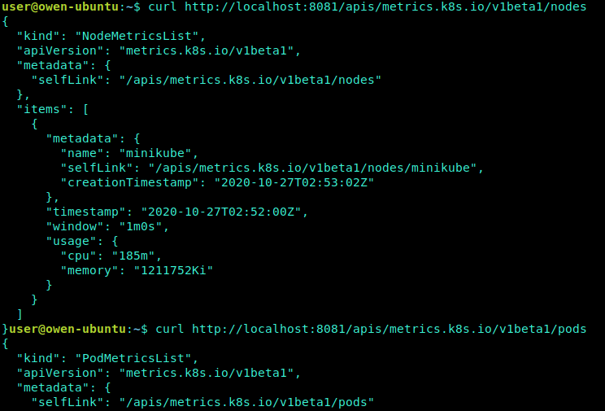

# Metrics Server

从 v1.8 开始，资源使用情况的监控可以通过 Metrics API的形式获取，具体的组件为Metrics Server，用来替换之前的heapster，heapster从1.11开始逐渐被废弃。

- <https://github.com/kubernetes-sigs/metrics-server>

## Metrics API

介绍Metrics-Server之前，必须要提一下Metrics API的概念

Metrics API相比于之前的监控采集方式(hepaster)是一种新的思路，官方希望核心指标的监控应该是稳定的，版本可控的，且可以直接被用户访问(例如通过使用 kubectl top 命令)，或由集群中的控制器使用(如HPA)，和其他的Kubernetes APIs一样。

官方废弃heapster项目，就是为了将核心资源监控作为一等公民对待，即像pod、service那样直接通过api-server或者client直接访问，不再是安装一个hepater来汇聚且由heapster单独管理。

## 部署 metrics-server

- 拉取镜像，修改tag，部署 metrics-server

    ``` shell
    docker pull registry.cn-hangzhou.aliyuncs.com/google_containers/metrics-server-amd64:v0.3.7
    docker tag registry.cn-hangzhou.aliyuncs.com/google_containers/metrics-server-amd64:v0.3.7 k8s.gcr.io/metrics-server-amd64:v0.3.7
    docker rmi registry.cn-hangzhou.aliyuncs.com/google_containers/metrics-server-amd64:v0.3.7

    kubectl apply -f https://github.com/kubernetes-sigs/metrics-server/releases/download/v0.3.7/components.yaml
    ```

- 查看部署情况

    `kubectl get pods --namespace=kube-system -o wide`

    

- 查看节点监控数据/Pod监控数据

    

- 使用Proxy代理接口测试

    ```shell
    kubectl proxy --port=8081
    curl http://localhost:8081/apis/metrics.k8s.io/v1beta1/nodes
    curl http://localhost:8081/apis/metrics.k8s.io/v1beta1/pods
    ```

    
